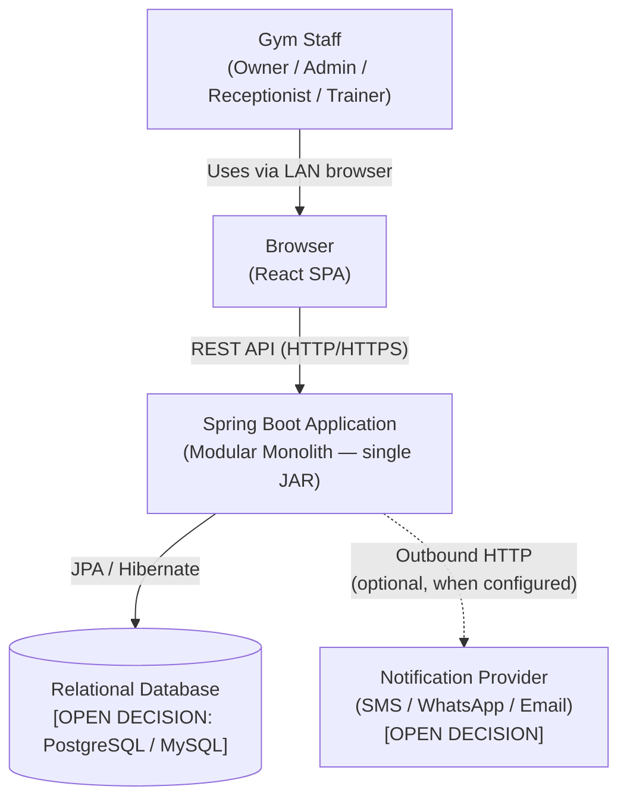
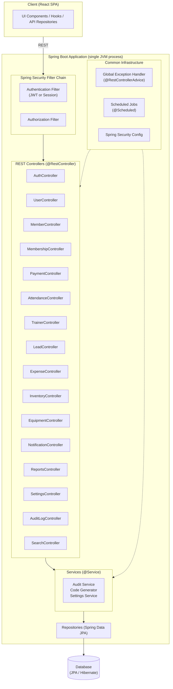
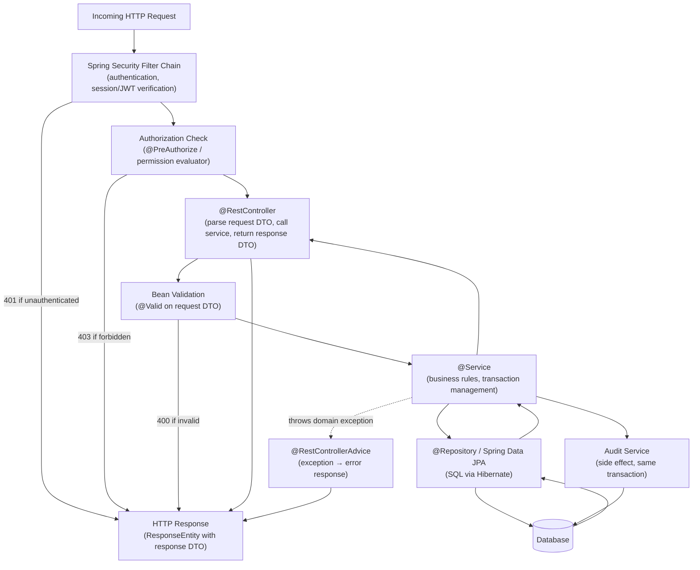
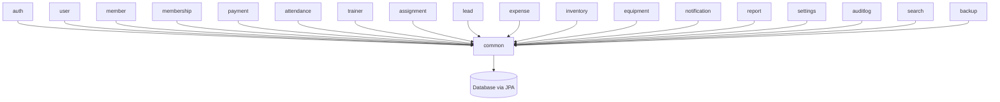
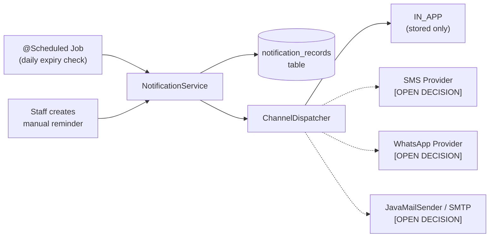

# 02 — System Architecture

## Technology Baseline

| Concern | Technology |
|---|---|
| Language | Java |
| Framework | Spring Boot |
| Architecture | Modular Monolith |
| API style | REST |
| Persistence | Spring Data JPA / Hibernate |
| Database | **OPEN DECISION** (PostgreSQL recommended — see below) |
| Migration tool | **OPEN DECISION** (Flyway or Liquibase) |
| Authentication | **OPEN DECISION** (Spring Security — JWT vs session-based) |
| API documentation | Springdoc OpenAPI / Swagger UI (proposed) |
| Testing | JUnit 5 + Spring Boot Test |
| Build tool | **OPEN DECISION** (Maven or Gradle) |

---

## Architecture Decision: Modular Monolith

This system is a **Modular Monolith**. All modules run inside a single Spring Boot application. Module boundaries are enforced through package conventions and dependency rules, not network calls.

**Rationale:**

| Factor | Justification |
|---|---|
| Scale | Single gym, ~500 active members, ~10 concurrent users. No multi-tenant, no high-traffic requirements. |
| Deployment | Runs on a local LAN machine. A single JAR is far simpler to deploy, restart, and manage than multiple services. |
| Transactions | Business operations frequently span multiple entities (membership + payment + audit). Transactions within one JVM are simple and reliable. |
| Team | Small team or single developer. Microservices would add coordination overhead with no benefit. |
| Spring Boot fit | Spring Boot is well suited to modular monolith. Package-by-feature provides clear boundaries without network complexity. |

Microservices, CQRS, event sourcing, and Kafka are explicitly **not** used. They add complexity without benefit at this scale.

---

## System Context Diagram



The notification provider connection is optional. The system must function fully without it.
All communication happens on the local network.

---

## Spring Boot Application Architecture



---

## Request Processing Pipeline



---

## Module Map

Each feature module lives in its own top-level package under `com.fitzone.gym`:

```
com.fitzone.gym
├── common/           ← shared infrastructure (no domain logic)
│   ├── audit/
│   ├── config/
│   ├── exception/
│   ├── response/
│   ├── security/
│   └── validation/
│
├── auth/             ← login, logout, current-user, profile update
├── user/             ← user management CRUD
├── member/           ← member CRUD + supplemental data
├── membershipplan/   ← plan CRUD
├── membership/       ← membership lifecycle
├── payment/          ← payment recording
├── attendance/       ← check-in marking
├── trainer/          ← trainer management
├── assignment/       ← member-trainer assignments
├── lead/             ← lead pipeline + conversion
├── expense/          ← expense + category management
├── inventory/        ← inventory items + transactions
├── equipment/        ← equipment + maintenance
├── notification/     ← notification records + dispatch
├── report/           ← aggregated reporting queries
├── settings/         ← gym configuration singleton
├── auditlog/         ← audit log API (read-only)
├── search/           ← global cross-entity search
└── backup/           ← backup and restore [OPEN DECISION: frontend UI pending]
```

**Package-by-feature** is used rather than package-by-layer (e.g., a top-level `controller/` package containing all controllers).

**Rationale:** For a modular monolith, package-by-feature keeps all code for a given domain in one place (controller, service, repository, entity, DTO). This makes features easier to understand and maintain. It also makes potential future extraction to a separate service straightforward.

---

## Internal Package Structure Per Module

Each feature module follows this consistent internal structure:

```
com.fitzone.gym.member
├── MemberController.java       ← @RestController, HTTP layer only
├── MemberService.java          ← @Service, business logic + transactions
├── MemberRepository.java       ← interface extends JpaRepository
├── Member.java                 ← @Entity, JPA mapping
├── dto/
│   ├── CreateMemberRequest.java   ← @Valid, bean validation annotations
│   ├── UpdateMemberRequest.java
│   └── MemberResponse.java        ← response shape, no @Entity exposure
└── exception/
    └── MemberPhoneDuplicateException.java  ← domain-specific exception
```

---

## Module Dependency Rules

Modules depend only on `common`. No module imports from another module's service or repository.



**Cross-module data access** (e.g., the reports module needs payment data) must go via database queries, not by injecting another module's service. The `common` package provides shared utilities (pagination, audit, code generation) available to all modules.

**Explicit exceptions** (documented, not undocumented):
- `report` module queries multiple tables directly — it has its own read-only query methods that span domains.
- `search` module queries multiple tables for global search.
- `notification` module queries `memberships` and `members` tables to compute expiry lists.

---

## Database

**OPEN DECISION:** Database engine.

| Option | Pros | Cons |
|---|---|---|
| **PostgreSQL** | Full constraints, JSON support, `pg_dump`, excellent Hibernate support, partial indexes | Requires installation |
| **MySQL / MariaDB** | Widely deployed, good Hibernate support | Fewer advanced constraint features (no partial indexes in MySQL < 8.0.13) |
| **H2** | Zero-config for dev/testing | Not suitable for production |

Recommendation: **PostgreSQL** for production due to constraint enforcement, concurrent write safety, and `pg_dump` backup. H2 for local development tests (`spring.datasource.url=jdbc:h2:mem:testdb`).

**OPEN DECISION:** Migration tool.

| Option | Notes |
|---|---|
| **Flyway** | SQL-first, simpler mental model, Spring Boot auto-configures, versioned migrations (`V1__init.sql`) |
| **Liquibase** | XML/YAML/SQL, more rollback support, more complex |

Recommendation: **Flyway** — simpler, works naturally with the SQL DDL already designed in `04-database-design.md`.

---

## Background Jobs

Spring's `@Scheduled` is sufficient for v1 scheduled work. No external job queue is needed.

| Job | Schedule |
|---|---|
| Expire memberships (update ACTIVE → EXPIRED where `end_date < today`) | Daily at midnight IST (`0 0 0 * * ?`) |
| Send expiry notifications | Daily at 9 AM IST (`0 0 9 * * ?`) |

Both jobs run within the same JVM. They are annotated with `@Scheduled` and managed by Spring's task executor.

A dedicated message queue (RabbitMQ, Kafka) is **not** used. The gym's operational volume does not justify asynchronous job infrastructure.

---

## Notification Architecture



In-app is always available. External channels require configuration. The system starts with IN_APP only and adds channels when a provider is chosen.

---

## Backup and Restore Architecture

**OPEN DECISION:** Backup mechanism.

Recommended: `pg_dump` subprocess invoked from a Spring `@Service`. The backup endpoint (`POST /api/v1/backup/create`) is restricted to OWNER.

**Note:** The backup/restore frontend UI is **not yet implemented**. The backend API should be designed and implemented; frontend integration is a separate task.

---

## Important Architectural Decisions

### Transaction Boundaries

All mutations that span multiple tables must run inside a single `@Transactional` method in the service layer. The audit log write is included in the same transaction as the primary operation.

### Business Logic Location

- **Controllers:** Parse request, call service, return response. No business logic.
- **Services:** All business rules, validation beyond schema, transactions, audit logging.
- **Repositories:** JPA queries and mutations only. No business logic.
- **Entities:** JPA mapping only. No business logic methods.

### Authorization Model

Frontend permission checks are UX (hiding buttons). Backend `@PreAuthorize` (or equivalent) is the actual security boundary. Every protected endpoint enforces authorization server-side, independently of the frontend.

### API Versioning

All endpoints use `/api/v1/` prefix. This allows future breaking changes under `/api/v2/` without disrupting existing clients.

### Frontend Serving

**OPEN DECISION:** Whether the Spring Boot backend serves the React SPA as static resources, or whether a separate static server (Nginx) is used.

- **Option A (simpler):** Spring Boot serves `frontend/dist/` as static resources. Single process, single port.
- **Option B (separate):** Nginx serves frontend, Spring Boot serves only API.

For a LAN gym system, Option A is recommended for operational simplicity.
