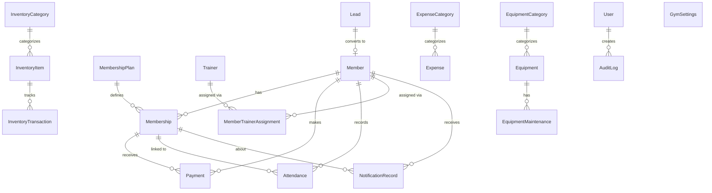

# 03 — Domain Model

This document defines the business domain independent of implementation. All entity definitions, relationships, and business rules are derived from the implemented frontend.

---

## Entity Overview



---

## Entities

### User

Represents a gym staff member who uses the system.

**Attributes:**

| Attribute | Type | Constraints | Notes |
|---|---|---|---|
| id | string (UUID) | PK | |
| userCode | string | UNIQUE, NOT NULL | Auto-generated (e.g., `USR-001`) |
| firstName | string | NOT NULL | |
| lastName | string | NOT NULL | |
| email | string | UNIQUE, NOT NULL | Login identifier |
| phone | string | nullable | |
| role | UserRole | NOT NULL | `OWNER \| ADMIN \| RECEPTIONIST \| TRAINER` |
| status | UserStatus | NOT NULL | `ACTIVE \| INACTIVE` |
| passwordHash | string | NOT NULL | bcrypt hash, never exposed in API |
| lastLoginAt | timestamp | nullable | Updated on each successful login |
| createdAt | timestamp | NOT NULL | |

**Lifecycle:**
- Created by OWNER or ADMIN.
- Deactivated by setting `status = INACTIVE` (not deleted, to preserve audit trail).
- Deleted only by OWNER.

**Invariants:**
- `email` must be unique.
- An INACTIVE user cannot authenticate.
- A user cannot change their own role or status.

---

### Member

Represents a gym member (customer).

**Attributes:**

| Attribute | Type | Constraints | Notes |
|---|---|---|---|
| id | string (UUID) | PK | |
| memberCode | string | UNIQUE, NOT NULL | Auto-generated (e.g., `MEM-001`) |
| firstName | string | NOT NULL | min 2, max 50 chars |
| lastName | string | NOT NULL | min 2, max 50 chars |
| phone | string | UNIQUE, NOT NULL | 10-digit Indian mobile |
| email | string | nullable | Must be valid if provided |
| status | MemberStatus | NOT NULL | `ACTIVE \| EXPIRED \| SUSPENDED \| CANCELLED` |
| joiningDate | date | NOT NULL | |
| dateOfBirth | date | nullable | Cannot be in future |
| gender | string | nullable | `Male \| Female \| Other` |
| address | string | nullable | |
| emergencyContactName | string | nullable | |
| emergencyContactPhone | string | nullable | |
| emergencyContactRelationship | string | nullable | |
| createdAt | timestamp | NOT NULL | |
| updatedAt | timestamp | NOT NULL | |

**Lifecycle:**
- Status transitions:
  - `ACTIVE` ← has a current active membership
  - `EXPIRED` ← membership has expired, no renewal
  - `SUSPENDED` ← manually suspended by staff
  - `CANCELLED` ← account closed

**Invariants:**
- `phone` must be exactly 10 digits, unique.
- `dateOfBirth` cannot be a future date.
- `memberCode` is system-generated and immutable.

---

### MembershipPlan

A reusable template defining the duration and price of a membership.

**Attributes:**

| Attribute | Type | Constraints | Notes |
|---|---|---|---|
| id | string (UUID) | PK | |
| name | string | NOT NULL | min 2, max 100 chars |
| description | string | nullable | |
| durationInDays | integer | NOT NULL, ≥ 1 | Positive whole number |
| price | decimal(10,2) | NOT NULL, > 0 | INR |
| status | PlanStatus | NOT NULL | `ACTIVE \| INACTIVE` |
| createdAt | timestamp | NOT NULL | |

**Lifecycle:**
- `ACTIVE` plans can be selected when creating memberships.
- `INACTIVE` plans cannot be used for new memberships but existing memberships using them remain valid.

**Invariants:**
- `durationInDays` must be ≥ 1.
- `price` must be > 0.

---

### Membership

A specific member's subscription to a plan, with concrete dates.

**Attributes:**

| Attribute | Type | Constraints | Notes |
|---|---|---|---|
| id | string (UUID) | PK | |
| memberId | UUID | FK → members, NOT NULL | |
| planId | UUID | FK → membership_plans, NOT NULL | |
| planName | string | NOT NULL | Snapshot of plan name at creation |
| startDate | date | NOT NULL | |
| endDate | date | NOT NULL | Computed: startDate + plan.durationInDays |
| amount | decimal(10,2) | NOT NULL | Snapshot of plan price at creation |
| status | MembershipStatus | NOT NULL | `ACTIVE \| EXPIRED \| CANCELLED` |
| createdAt | timestamp | NOT NULL | |

**Lifecycle:**
```
(created) → ACTIVE → EXPIRED (endDate passes) | CANCELLED (manually)
```

**Invariants:**
- `endDate = startDate + plan.durationInDays` — computed at creation, immutable.
- `amount` is a snapshot of the plan's price at creation time; plan price changes do not retroactively affect existing memberships.
- `planName` is a snapshot for display when the plan is later renamed or deleted.
- A member should have at most one `ACTIVE` membership at a time. **OPEN DECISION:** Hard constraint or warning?
- Memberships are not editable after creation.

---

### Payment

A financial transaction recording money received.

**Attributes:**

| Attribute | Type | Constraints | Notes |
|---|---|---|---|
| id | string (UUID) | PK | |
| memberId | UUID | FK → members, NOT NULL | |
| membershipId | UUID | FK → memberships, nullable | Payments may be standalone |
| amount | decimal(10,2) | NOT NULL, > 0 | INR |
| paymentMethod | PaymentMethod | NOT NULL | `CASH \| UPI \| CARD \| BANK_TRANSFER` |
| paymentDate | date | NOT NULL | |
| status | PaymentStatus | NOT NULL | `COMPLETED \| PENDING \| REFUNDED` |
| reference | string | nullable | UPI reference, receipt number, etc. |
| notes | string | nullable | |
| createdAt | timestamp | NOT NULL | |

**Invariants:**
- `amount` must be > 0.
- Only `COMPLETED` payments count toward revenue calculations.

---

### Attendance

A record of a member's daily check-in.

**Attributes:**

| Attribute | Type | Constraints | Notes |
|---|---|---|---|
| id | string (UUID) | PK | |
| memberId | UUID | FK → members, NOT NULL | |
| membershipId | UUID | FK → memberships, nullable | |
| attendanceDate | date | NOT NULL | Date in IST |
| checkInTime | string | NOT NULL | HH:MM format |
| status | AttendanceStatus | NOT NULL | Only value: `PRESENT` |
| createdAt | timestamp | NOT NULL | |

**Invariants:**
- `UNIQUE(memberId, attendanceDate)` — A member can only have one attendance record per day.
- Attendance records are only created for present members. Absence is represented by the absence of a record.
- Whether expired membership holders can mark attendance is controlled by `allowAttendanceForExpiredMembership` in GymSettings.

---

### Trainer

A gym trainer who may be assigned to members.

**Attributes:**

| Attribute | Type | Constraints | Notes |
|---|---|---|---|
| id | string (UUID) | PK | |
| trainerCode | string | UNIQUE, NOT NULL | Auto-generated (e.g., `TRN-001`) |
| firstName | string | NOT NULL | |
| lastName | string | NOT NULL | |
| phone | string | NOT NULL | |
| email | string | nullable | |
| specialization | string | nullable | e.g., "Weight Training", "Yoga" |
| joiningDate | date | NOT NULL | |
| status | TrainerStatus | NOT NULL | `ACTIVE \| INACTIVE` |
| createdAt | timestamp | NOT NULL | |
| updatedAt | timestamp | NOT NULL | |

**Invariants:**
- `trainerCode` is system-generated and immutable.

---

### MemberTrainerAssignment

Associates a member with a trainer for a period of time.

**Attributes:**

| Attribute | Type | Constraints | Notes |
|---|---|---|---|
| id | string (UUID) | PK | |
| memberId | UUID | FK → members, NOT NULL | |
| trainerId | UUID | FK → trainers, NOT NULL | |
| startDate | date | NOT NULL | |
| endDate | date | nullable | Set when assignment ends |
| status | AssignmentStatus | NOT NULL | `ACTIVE \| ENDED` |
| createdAt | timestamp | NOT NULL | |

**Lifecycle:**
```
(created) → ACTIVE → ENDED (manually or when re-assigned)
```

**Invariants:**
- A member can have at most one `ACTIVE` assignment at a time.
- When a new assignment is created, the existing ACTIVE assignment for that member is automatically ENDED.
- `endDate` is set when `status` transitions to `ENDED`.

---

### Lead

A prospective member being tracked in the sales pipeline.

**Attributes:**

| Attribute | Type | Constraints | Notes |
|---|---|---|---|
| id | string (UUID) | PK | |
| leadCode | string | UNIQUE, NOT NULL | Auto-generated (e.g., `LEAD-001`) |
| name | string | NOT NULL | min 2, max 100 chars |
| phone | string | NOT NULL | 7–15 chars, international format |
| email | string | nullable | |
| source | LeadSource | nullable | `WALK_IN \| PHONE \| WEBSITE \| REFERRAL \| SOCIAL_MEDIA \| OTHER` |
| interestedPlanId | UUID | FK → membership_plans, nullable | |
| status | LeadStatus | NOT NULL | See lifecycle below |
| notes | string | nullable | |
| lastFollowUpDate | date | nullable | |
| nextFollowUpDate | date | nullable | |
| convertedMemberId | UUID | FK → members, nullable | Set on conversion |
| createdAt | timestamp | NOT NULL | |

**Lifecycle:**
```
NEW → CONTACTED → INTERESTED → FOLLOW_UP → CONVERTED | LOST
```

**Invariants:**
- On conversion: `status = CONVERTED`, `convertedMemberId` is set to the newly created member.
- Once CONVERTED or LOST, the lead is effectively closed (no further status changes expected).

---

### ExpenseCategory

A classification for expenses.

**Attributes:**

| Attribute | Type | Constraints | Notes |
|---|---|---|---|
| id | string (UUID) | PK | |
| name | string | NOT NULL | |
| description | string | nullable | |
| status | string | NOT NULL | `ACTIVE \| INACTIVE` |

---

### Expense

An operational expenditure recorded by the gym.

**Attributes:**

| Attribute | Type | Constraints | Notes |
|---|---|---|---|
| id | string (UUID) | PK | |
| expenseCode | string | UNIQUE, NOT NULL | Auto-generated (e.g., `EXP-001`) |
| categoryId | UUID | FK → expense_categories, NOT NULL | |
| description | string | NOT NULL | |
| amount | decimal(10,2) | NOT NULL, > 0 | INR |
| expenseDate | date | NOT NULL | |
| paymentMethod | PaymentMethod | NOT NULL | `CASH \| UPI \| CARD \| BANK_TRANSFER` |
| vendor | string | nullable | |
| notes | string | nullable | |
| createdAt | timestamp | NOT NULL | |

**Invariants:**
- `amount` must be > 0.
- Expenses are separate from inventory stock purchases.

---

### InventoryCategory

A classification for inventory items.

**Attributes:**

| Attribute | Type | Constraints |
|---|---|---|
| id | UUID | PK |
| name | string | NOT NULL |
| description | string | nullable |
| status | string | NOT NULL (`ACTIVE \| INACTIVE`) |

---

### InventoryItem

A stocked good tracked by quantity.

**Attributes:**

| Attribute | Type | Constraints | Notes |
|---|---|---|---|
| id | string (UUID) | PK | |
| itemCode | string | UNIQUE, NOT NULL | Auto-generated |
| name | string | NOT NULL | |
| categoryId | UUID | FK → inventory_categories, NOT NULL | |
| unit | string | NOT NULL | e.g., "kg", "pcs", "bottles" |
| currentStock | integer | NOT NULL | **Derived** from transaction sum |
| minimumStock | integer | NOT NULL, ≥ 0 | Low-stock threshold |
| status | InventoryItemStatus | NOT NULL | **Derived** (see rules) |
| description | string | nullable | |
| createdAt | timestamp | NOT NULL | |
| updatedAt | timestamp | NOT NULL | |

**Derived values:**
- `currentStock` = sum of all transaction quantities for this item (STOCK_IN positive, STOCK_OUT negative, ADJUSTMENT sets directly).
- `status`:
  - `currentStock == 0` → `OUT_OF_STOCK`
  - `currentStock <= minimumStock` → `LOW_STOCK`
  - `currentStock > minimumStock` → `IN_STOCK`

**OPEN DECISION:** Whether `currentStock` and `status` are stored columns (updated on each transaction) or computed views. Storing is simpler for queries; computing ensures correctness.

---

### InventoryTransaction

A stock movement event for an inventory item.

**Attributes:**

| Attribute | Type | Constraints | Notes |
|---|---|---|---|
| id | string (UUID) | PK | |
| itemId | UUID | FK → inventory_items, NOT NULL | |
| type | TransactionType | NOT NULL | `STOCK_IN \| STOCK_OUT \| ADJUSTMENT` |
| quantity | integer | NOT NULL | Positive for IN, positive for OUT (type determines sign) |
| transactionDate | date | NOT NULL | |
| reference | string | nullable | |
| notes | string | nullable | |
| createdAt | timestamp | NOT NULL | |

**Invariants:**
- Stock cannot go negative (STOCK_OUT must be rejected if it would result in negative currentStock). **OPEN DECISION:** Hard error or warning?

---

### EquipmentCategory

A classification for equipment.

**Attributes:**

| Attribute | Type | Constraints |
|---|---|---|
| id | UUID | PK |
| name | string | NOT NULL |
| description | string | nullable |
| status | string | NOT NULL (`ACTIVE \| INACTIVE`) |

---

### Equipment

A physical gym equipment item.

**Attributes:**

| Attribute | Type | Constraints | Notes |
|---|---|---|---|
| id | string (UUID) | PK | |
| equipmentCode | string | UNIQUE, NOT NULL | Auto-generated (e.g., `EQ-001`) |
| name | string | NOT NULL | |
| categoryId | UUID | FK → equipment_categories, NOT NULL | |
| brand | string | nullable | |
| model | string | nullable | |
| serialNumber | string | nullable | |
| purchaseDate | date | nullable | |
| purchaseCost | decimal(10,2) | nullable | |
| location | string | nullable | e.g., "Floor 1", "Cardio Zone" |
| status | EquipmentStatus | NOT NULL | `ACTIVE \| UNDER_MAINTENANCE \| OUT_OF_SERVICE \| RETIRED` |
| notes | string | nullable | |
| createdAt | timestamp | NOT NULL | |
| updatedAt | timestamp | NOT NULL | |

**Lifecycle:**
```
ACTIVE ↔ UNDER_MAINTENANCE → ACTIVE | OUT_OF_SERVICE → RETIRED
```

---

### EquipmentMaintenance

A single maintenance event for a piece of equipment.

**Attributes:**

| Attribute | Type | Constraints | Notes |
|---|---|---|---|
| id | string (UUID) | PK | |
| equipmentId | UUID | FK → equipment, NOT NULL | |
| maintenanceDate | date | NOT NULL | |
| maintenanceType | MaintenanceType | NOT NULL | `ROUTINE \| REPAIR \| INSPECTION \| REPLACEMENT` |
| description | string | NOT NULL | |
| cost | decimal(10,2) | nullable | |
| performedBy | string | nullable | Name or company |
| nextMaintenanceDate | date | nullable | |
| notes | string | nullable | |
| createdAt | timestamp | NOT NULL | |

**Invariants:**
- Maintenance records are append-only. They cannot be edited or deleted.

---

### NotificationRecord

A record of a notification sent (or to be sent) to a member.

**Attributes:**

| Attribute | Type | Constraints | Notes |
|---|---|---|---|
| id | string (UUID) | PK | |
| memberId | UUID | FK → members, NOT NULL | |
| membershipId | UUID | FK → memberships, NOT NULL | |
| type | NotificationType | NOT NULL | `EXPIRY_REMINDER \| EXPIRED_NOTICE \| CUSTOM` |
| channel | NotificationChannel | NOT NULL | `SMS \| WHATSAPP \| EMAIL \| IN_APP` |
| status | NotificationStatus | NOT NULL | `PENDING \| SENT \| FAILED` |
| message | string | NOT NULL | |
| createdAt | timestamp | NOT NULL | |
| sentAt | timestamp | nullable | Set when dispatched |

**Invariants:**
- A notification must be linked to both a member and a membership.
- `sentAt` is set only when the notification is successfully dispatched.

---

### AuditLog

A tamper-evident record of every significant action in the system.

**Attributes:**

| Attribute | Type | Constraints | Notes |
|---|---|---|---|
| id | string (UUID) | PK | |
| timestamp | timestamp | NOT NULL | UTC |
| userId | UUID | FK → users, NOT NULL | Actor who performed the action |
| action | AuditAction | NOT NULL | `CREATE \| UPDATE \| DELETE \| LOGIN \| LOGOUT \| VIEW \| EXPORT` |
| entityType | AuditEntityType | NOT NULL | See entity type list in requirements |
| entityId | string | nullable | ID of the affected entity |
| entityName | string | nullable | Human-readable name snapshot |
| description | string | NOT NULL | Plain-English description |
| status | AuditStatus | NOT NULL | `SUCCESS \| FAILED` |
| metadata | JSON | nullable | Additional context |

**Invariants:**
- Audit logs are immutable. No UPDATE or DELETE.
- Even failed operations produce audit records.

---

### GymSettings

A single-row configuration record for the gym.

**Attributes:**

| Attribute | Type | Constraints | Notes |
|---|---|---|---|
| id | integer | PK | Always `1` (singleton) |
| gymName | string | NOT NULL | min 2, max 100 chars |
| phone | string | nullable | |
| email | string | nullable | |
| address | string | nullable | max 300 chars |
| currency | string | NOT NULL | Always `INR` |
| timezone | string | NOT NULL | Always `Asia/Kolkata` |
| dateFormat | string | NOT NULL | `DD/MM/YYYY \| MM/DD/YYYY \| YYYY-MM-DD` |
| membershipGracePeriodDays | integer | NOT NULL, ≥ 0 | Days after expiry before access is denied |
| attendanceStartTime | string | nullable | HH:MM format |
| attendanceEndTime | string | nullable | HH:MM, must be > attendanceStartTime |
| allowAttendanceForExpiredMembership | boolean | NOT NULL | Default: false |

**Invariants:**
- There is exactly one row in this table at all times (singleton).
- `attendanceEndTime` must be after `attendanceStartTime` if both are set.

---

## Key Business Rules Reference

| Rule | Source |
|---|---|
| Member `phone` must be 10 digits and unique | member.schema.ts |
| Member `dateOfBirth` cannot be in the future | member.schema.ts |
| MembershipPlan `price > 0` | membership-plan.schema.ts |
| MembershipPlan `durationInDays ≥ 1` (integer) | membership-plan.schema.ts |
| Membership `endDate = startDate + plan.durationInDays` | Derived at creation |
| Membership `amount` is snapshot at creation, immutable | membership.types.ts |
| At most one ACTIVE membership per member | **OPEN DECISION** (DB or app) |
| Payment `amount > 0` | payment.schema.ts |
| Revenue = sum of `COMPLETED` payments | OverviewReport.tsx, RevenueReport.tsx |
| Net Cash Flow = Revenue − Expenses | OverviewReport.tsx |
| Attendance is `PRESENT`-only (no ABSENT records) | attendance.types.ts |
| `UNIQUE(memberId, attendanceDate)` | Cross-cutting concerns |
| Inventory `status` is derived from `currentStock` and `minimumStock` | inventory.utils.ts |
| `currentStock` cannot go negative | inventory domain rule |
| Lead converts → `status = CONVERTED`, `convertedMemberId` set | lead.types.ts |
| Maintenance records are append-only | equipment domain rule |
| Audit logs are immutable | audit-log domain rule |
| Settings are a singleton (one row) | settings.types.ts |
| Grace period: `membershipGracePeriodDays` controls post-expiry access | settings.types.ts |
| `allowAttendanceForExpiredMembership = false` → expired members denied attendance | settings.types.ts |
