# 04 — Database Design

**OPEN DECISION:** Database engine (PostgreSQL recommended; see `02-system-architecture.md`).

All type annotations below use PostgreSQL types. SQLite equivalents are noted where they differ.

---

## ER Diagram

```mermaid
erDiagram
    users {
        uuid id PK
        varchar user_code UK
        varchar first_name
        varchar last_name
        varchar email UK
        varchar phone
        user_role role
        user_status status
        varchar password_hash
        timestamptz last_login_at
        timestamptz created_at
    }

    members {
        uuid id PK
        varchar member_code UK
        varchar first_name
        varchar last_name
        varchar phone UK
        varchar email
        member_status status
        date joining_date
        date date_of_birth
        varchar gender
        text address
        varchar emergency_contact_name
        varchar emergency_contact_phone
        varchar emergency_contact_relationship
        timestamptz created_at
        timestamptz updated_at
    }

    membership_plans {
        uuid id PK
        varchar name
        text description
        int duration_in_days
        decimal price
        plan_status status
        timestamptz created_at
    }

    memberships {
        uuid id PK
        uuid member_id FK
        uuid plan_id FK
        varchar plan_name
        date start_date
        date end_date
        decimal amount
        membership_status status
        timestamptz created_at
    }

    payments {
        uuid id PK
        uuid member_id FK
        uuid membership_id FK
        decimal amount
        payment_method payment_method
        date payment_date
        payment_status status
        varchar reference
        text notes
        timestamptz created_at
    }

    attendance {
        uuid id PK
        uuid member_id FK
        uuid membership_id FK
        date attendance_date
        varchar check_in_time
        attendance_status status
        timestamptz created_at
    }

    trainers {
        uuid id PK
        varchar trainer_code UK
        varchar first_name
        varchar last_name
        varchar phone
        varchar email
        varchar specialization
        date joining_date
        trainer_status status
        timestamptz created_at
        timestamptz updated_at
    }

    member_trainer_assignments {
        uuid id PK
        uuid member_id FK
        uuid trainer_id FK
        date start_date
        date end_date
        assignment_status status
        timestamptz created_at
    }

    leads {
        uuid id PK
        varchar lead_code UK
        varchar name
        varchar phone
        varchar email
        lead_source source
        uuid interested_plan_id FK
        lead_status status
        text notes
        date last_follow_up_date
        date next_follow_up_date
        uuid converted_member_id FK
        timestamptz created_at
    }

    expense_categories {
        uuid id PK
        varchar name
        text description
        category_status status
    }

    expenses {
        uuid id PK
        varchar expense_code UK
        uuid category_id FK
        text description
        decimal amount
        date expense_date
        expense_payment_method payment_method
        varchar vendor
        text notes
        timestamptz created_at
    }

    inventory_categories {
        uuid id PK
        varchar name
        text description
        category_status status
    }

    inventory_items {
        uuid id PK
        varchar item_code UK
        varchar name
        uuid category_id FK
        varchar unit
        int current_stock
        int minimum_stock
        inventory_status status
        text description
        timestamptz created_at
        timestamptz updated_at
    }

    inventory_transactions {
        uuid id PK
        uuid item_id FK
        inventory_transaction_type type
        int quantity
        date transaction_date
        varchar reference
        text notes
        timestamptz created_at
    }

    equipment_categories {
        uuid id PK
        varchar name
        text description
        category_status status
    }

    equipment {
        uuid id PK
        varchar equipment_code UK
        varchar name
        uuid category_id FK
        varchar brand
        varchar model
        varchar serial_number
        date purchase_date
        decimal purchase_cost
        varchar location
        equipment_status status
        text notes
        timestamptz created_at
        timestamptz updated_at
    }

    equipment_maintenance {
        uuid id PK
        uuid equipment_id FK
        date maintenance_date
        maintenance_type maintenance_type
        text description
        decimal cost
        varchar performed_by
        date next_maintenance_date
        text notes
        timestamptz created_at
    }

    notification_records {
        uuid id PK
        uuid member_id FK
        uuid membership_id FK
        notification_type type
        notification_channel channel
        notification_status status
        text message
        timestamptz created_at
        timestamptz sent_at
    }

    audit_logs {
        uuid id PK
        timestamptz timestamp
        uuid user_id FK
        audit_action action
        audit_entity_type entity_type
        varchar entity_id
        varchar entity_name
        text description
        audit_status status
        jsonb metadata
    }

    gym_settings {
        int id PK
        varchar gym_name
        varchar phone
        varchar email
        text address
        varchar currency
        varchar timezone
        varchar date_format
        int membership_grace_period_days
        varchar attendance_start_time
        varchar attendance_end_time
        bool allow_attendance_for_expired_membership
    }

    members ||--o{ memberships : "member_id"
    membership_plans ||--o{ memberships : "plan_id"
    members ||--o{ payments : "member_id"
    memberships ||--o{ payments : "membership_id"
    members ||--o{ attendance : "member_id"
    memberships ||--o{ attendance : "membership_id"
    members ||--o{ member_trainer_assignments : "member_id"
    trainers ||--o{ member_trainer_assignments : "trainer_id"
    membership_plans ||--o{ leads : "interested_plan_id"
    members ||--o{ leads : "converted_member_id"
    expense_categories ||--o{ expenses : "category_id"
    inventory_categories ||--o{ inventory_items : "category_id"
    inventory_items ||--o{ inventory_transactions : "item_id"
    equipment_categories ||--o{ equipment : "category_id"
    equipment ||--o{ equipment_maintenance : "equipment_id"
    members ||--o{ notification_records : "member_id"
    memberships ||--o{ notification_records : "membership_id"
    users ||--o{ audit_logs : "user_id"
```



---

## Table Definitions

### `users`

```sql
CREATE TYPE user_role AS ENUM ('OWNER', 'ADMIN', 'RECEPTIONIST', 'TRAINER');
CREATE TYPE user_status AS ENUM ('ACTIVE', 'INACTIVE');

CREATE TABLE users (
    id              UUID PRIMARY KEY DEFAULT gen_random_uuid(),
    user_code       VARCHAR(20) NOT NULL UNIQUE,
    first_name      VARCHAR(50) NOT NULL,
    last_name       VARCHAR(50) NOT NULL,
    email           VARCHAR(255) NOT NULL UNIQUE,
    phone           VARCHAR(20),
    role            user_role NOT NULL,
    status          user_status NOT NULL DEFAULT 'ACTIVE',
    password_hash   VARCHAR(255) NOT NULL,
    last_login_at   TIMESTAMPTZ,
    created_at      TIMESTAMPTZ NOT NULL DEFAULT NOW()
);
```

**Indexes:**
- `email` (unique — already enforced)
- `user_code` (unique — already enforced)
- `role` (for user management filtering)

---

### `members`

```sql
CREATE TYPE member_status AS ENUM ('ACTIVE', 'EXPIRED', 'SUSPENDED', 'CANCELLED');

CREATE TABLE members (
    id                              UUID PRIMARY KEY DEFAULT gen_random_uuid(),
    member_code                     VARCHAR(20) NOT NULL UNIQUE,
    first_name                      VARCHAR(50) NOT NULL,
    last_name                       VARCHAR(50) NOT NULL,
    phone                           VARCHAR(10) NOT NULL UNIQUE,
    email                           VARCHAR(255),
    status                          member_status NOT NULL DEFAULT 'ACTIVE',
    joining_date                    DATE NOT NULL,
    date_of_birth                   DATE,
    gender                          VARCHAR(10),
    address                         TEXT,
    emergency_contact_name          VARCHAR(100),
    emergency_contact_phone         VARCHAR(20),
    emergency_contact_relationship  VARCHAR(50),
    created_at                      TIMESTAMPTZ NOT NULL DEFAULT NOW(),
    updated_at                      TIMESTAMPTZ NOT NULL DEFAULT NOW(),

    CONSTRAINT chk_phone_digits CHECK (phone ~ '^\d{10}$'),
    CONSTRAINT chk_dob_past CHECK (date_of_birth IS NULL OR date_of_birth < CURRENT_DATE)
);
```

**Indexes:**
- `phone` (unique)
- `status` (for filtering active members)
- `first_name, last_name` (for search — consider GIN full-text index)
- `joining_date` (for new-member reports)

---

### `membership_plans`

```sql
CREATE TYPE plan_status AS ENUM ('ACTIVE', 'INACTIVE');

CREATE TABLE membership_plans (
    id              UUID PRIMARY KEY DEFAULT gen_random_uuid(),
    name            VARCHAR(100) NOT NULL,
    description     TEXT,
    duration_in_days INT NOT NULL,
    price           DECIMAL(10, 2) NOT NULL,
    status          plan_status NOT NULL DEFAULT 'ACTIVE',
    created_at      TIMESTAMPTZ NOT NULL DEFAULT NOW(),

    CONSTRAINT chk_duration_positive CHECK (duration_in_days >= 1),
    CONSTRAINT chk_price_positive CHECK (price > 0)
);
```

---

### `memberships`

```sql
CREATE TYPE membership_status AS ENUM ('ACTIVE', 'EXPIRED', 'CANCELLED');

CREATE TABLE memberships (
    id          UUID PRIMARY KEY DEFAULT gen_random_uuid(),
    member_id   UUID NOT NULL REFERENCES members(id) ON DELETE RESTRICT,
    plan_id     UUID NOT NULL REFERENCES membership_plans(id) ON DELETE RESTRICT,
    plan_name   VARCHAR(100) NOT NULL,
    start_date  DATE NOT NULL,
    end_date    DATE NOT NULL,
    amount      DECIMAL(10, 2) NOT NULL,
    status      membership_status NOT NULL DEFAULT 'ACTIVE',
    created_at  TIMESTAMPTZ NOT NULL DEFAULT NOW(),

    CONSTRAINT chk_dates CHECK (end_date >= start_date),
    CONSTRAINT chk_amount_positive CHECK (amount > 0)
);

-- Enforce at most one ACTIVE membership per member
-- OPEN DECISION: whether to use partial index or application-level check
CREATE UNIQUE INDEX uidx_one_active_membership
    ON memberships(member_id)
    WHERE status = 'ACTIVE';
```

**Indexes:**
- `member_id` (FK + queries by member)
- `status` (filtering)
- `end_date` (expiry queries, notifications)
- Partial unique index on `(member_id) WHERE status = 'ACTIVE'`

---

### `payments`

```sql
CREATE TYPE payment_method AS ENUM ('CASH', 'UPI', 'CARD', 'BANK_TRANSFER');
CREATE TYPE payment_status AS ENUM ('COMPLETED', 'PENDING', 'REFUNDED');

CREATE TABLE payments (
    id              UUID PRIMARY KEY DEFAULT gen_random_uuid(),
    member_id       UUID NOT NULL REFERENCES members(id) ON DELETE RESTRICT,
    membership_id   UUID REFERENCES memberships(id) ON DELETE SET NULL,
    amount          DECIMAL(10, 2) NOT NULL,
    payment_method  payment_method NOT NULL,
    payment_date    DATE NOT NULL,
    status          payment_status NOT NULL DEFAULT 'COMPLETED',
    reference       VARCHAR(100),
    notes           TEXT,
    created_at      TIMESTAMPTZ NOT NULL DEFAULT NOW(),

    CONSTRAINT chk_amount_positive CHECK (amount > 0)
);
```

**Indexes:**
- `member_id` (FK)
- `membership_id` (FK)
- `payment_date` (date range queries, revenue reports)
- `status` (filtering completed payments for revenue)

---

### `attendance`

```sql
CREATE TYPE attendance_status AS ENUM ('PRESENT');

CREATE TABLE attendance (
    id              UUID PRIMARY KEY DEFAULT gen_random_uuid(),
    member_id       UUID NOT NULL REFERENCES members(id) ON DELETE RESTRICT,
    membership_id   UUID REFERENCES memberships(id) ON DELETE SET NULL,
    attendance_date DATE NOT NULL,
    check_in_time   VARCHAR(5) NOT NULL,
    status          attendance_status NOT NULL DEFAULT 'PRESENT',
    created_at      TIMESTAMPTZ NOT NULL DEFAULT NOW(),

    CONSTRAINT uq_member_attendance_date UNIQUE (member_id, attendance_date)
);
```

**Indexes:**
- `member_id` (FK)
- `attendance_date` (date range queries)
- Composite `(member_id, attendance_date)` (unique, also serves as index)

---

### `trainers`

```sql
CREATE TYPE trainer_status AS ENUM ('ACTIVE', 'INACTIVE');

CREATE TABLE trainers (
    id              UUID PRIMARY KEY DEFAULT gen_random_uuid(),
    trainer_code    VARCHAR(20) NOT NULL UNIQUE,
    first_name      VARCHAR(50) NOT NULL,
    last_name       VARCHAR(50) NOT NULL,
    phone           VARCHAR(20) NOT NULL,
    email           VARCHAR(255),
    specialization  VARCHAR(100),
    joining_date    DATE NOT NULL,
    status          trainer_status NOT NULL DEFAULT 'ACTIVE',
    created_at      TIMESTAMPTZ NOT NULL DEFAULT NOW(),
    updated_at      TIMESTAMPTZ NOT NULL DEFAULT NOW()
);
```

---

### `member_trainer_assignments`

```sql
CREATE TYPE assignment_status AS ENUM ('ACTIVE', 'ENDED');

CREATE TABLE member_trainer_assignments (
    id          UUID PRIMARY KEY DEFAULT gen_random_uuid(),
    member_id   UUID NOT NULL REFERENCES members(id) ON DELETE RESTRICT,
    trainer_id  UUID NOT NULL REFERENCES trainers(id) ON DELETE RESTRICT,
    start_date  DATE NOT NULL,
    end_date    DATE,
    status      assignment_status NOT NULL DEFAULT 'ACTIVE',
    created_at  TIMESTAMPTZ NOT NULL DEFAULT NOW()
);

-- At most one ACTIVE assignment per member
CREATE UNIQUE INDEX uidx_one_active_assignment
    ON member_trainer_assignments(member_id)
    WHERE status = 'ACTIVE';
```

---

### `leads`

```sql
CREATE TYPE lead_status AS ENUM ('NEW', 'CONTACTED', 'INTERESTED', 'FOLLOW_UP', 'CONVERTED', 'LOST');
CREATE TYPE lead_source AS ENUM ('WALK_IN', 'PHONE', 'WEBSITE', 'REFERRAL', 'SOCIAL_MEDIA', 'OTHER');

CREATE TABLE leads (
    id                  UUID PRIMARY KEY DEFAULT gen_random_uuid(),
    lead_code           VARCHAR(20) NOT NULL UNIQUE,
    name                VARCHAR(100) NOT NULL,
    phone               VARCHAR(20) NOT NULL,
    email               VARCHAR(255),
    source              lead_source,
    interested_plan_id  UUID REFERENCES membership_plans(id) ON DELETE SET NULL,
    status              lead_status NOT NULL DEFAULT 'NEW',
    notes               TEXT,
    last_follow_up_date DATE,
    next_follow_up_date DATE,
    converted_member_id UUID REFERENCES members(id) ON DELETE SET NULL,
    created_at          TIMESTAMPTZ NOT NULL DEFAULT NOW()
);
```

**Indexes:**
- `status` (pipeline filtering)
- `created_at` (date range in reports)
- `next_follow_up_date` (follow-up queries)

---

### `expense_categories`

```sql
CREATE TYPE category_status AS ENUM ('ACTIVE', 'INACTIVE');

CREATE TABLE expense_categories (
    id          UUID PRIMARY KEY DEFAULT gen_random_uuid(),
    name        VARCHAR(100) NOT NULL,
    description TEXT,
    status      category_status NOT NULL DEFAULT 'ACTIVE'
);
```

---

### `expenses`

```sql
CREATE TYPE expense_payment_method AS ENUM ('CASH', 'UPI', 'CARD', 'BANK_TRANSFER');

CREATE TABLE expenses (
    id              UUID PRIMARY KEY DEFAULT gen_random_uuid(),
    expense_code    VARCHAR(20) NOT NULL UNIQUE,
    category_id     UUID NOT NULL REFERENCES expense_categories(id) ON DELETE RESTRICT,
    description     TEXT NOT NULL,
    amount          DECIMAL(10, 2) NOT NULL,
    expense_date    DATE NOT NULL,
    payment_method  expense_payment_method NOT NULL,
    vendor          VARCHAR(100),
    notes           TEXT,
    created_at      TIMESTAMPTZ NOT NULL DEFAULT NOW(),

    CONSTRAINT chk_expense_amount_positive CHECK (amount > 0)
);
```

**Indexes:**
- `expense_date` (date range in expense reports)
- `category_id` (category filtering)

---

### `inventory_categories`

```sql
CREATE TABLE inventory_categories (
    id          UUID PRIMARY KEY DEFAULT gen_random_uuid(),
    name        VARCHAR(100) NOT NULL,
    description TEXT,
    status      category_status NOT NULL DEFAULT 'ACTIVE'
);
```

---

### `inventory_items`

```sql
CREATE TYPE inventory_status AS ENUM ('IN_STOCK', 'LOW_STOCK', 'OUT_OF_STOCK');

CREATE TABLE inventory_items (
    id              UUID PRIMARY KEY DEFAULT gen_random_uuid(),
    item_code       VARCHAR(20) NOT NULL UNIQUE,
    name            VARCHAR(100) NOT NULL,
    category_id     UUID NOT NULL REFERENCES inventory_categories(id) ON DELETE RESTRICT,
    unit            VARCHAR(20) NOT NULL,
    current_stock   INT NOT NULL DEFAULT 0,
    minimum_stock   INT NOT NULL DEFAULT 0,
    status          inventory_status NOT NULL DEFAULT 'IN_STOCK',
    description     TEXT,
    created_at      TIMESTAMPTZ NOT NULL DEFAULT NOW(),
    updated_at      TIMESTAMPTZ NOT NULL DEFAULT NOW(),

    CONSTRAINT chk_stock_non_negative CHECK (current_stock >= 0),
    CONSTRAINT chk_minimum_stock_non_negative CHECK (minimum_stock >= 0)
);
```

**Note:** `current_stock` and `status` are stored columns, updated transactionally when an `inventory_transaction` is recorded. This denormalization is intentional for query performance.

**Indexes:**
- `status` (inventory status filtering)
- `category_id` (category filtering)

---

### `inventory_transactions`

```sql
CREATE TYPE inventory_transaction_type AS ENUM ('STOCK_IN', 'STOCK_OUT', 'ADJUSTMENT');

CREATE TABLE inventory_transactions (
    id              UUID PRIMARY KEY DEFAULT gen_random_uuid(),
    item_id         UUID NOT NULL REFERENCES inventory_items(id) ON DELETE RESTRICT,
    type            inventory_transaction_type NOT NULL,
    quantity        INT NOT NULL,
    transaction_date DATE NOT NULL,
    reference       VARCHAR(100),
    notes           TEXT,
    created_at      TIMESTAMPTZ NOT NULL DEFAULT NOW(),

    CONSTRAINT chk_quantity_positive CHECK (quantity > 0)
);
```

**Indexes:**
- `item_id` (FK + transaction history queries)
- `transaction_date` (date range queries)

---

### `equipment_categories`

```sql
CREATE TABLE equipment_categories (
    id          UUID PRIMARY KEY DEFAULT gen_random_uuid(),
    name        VARCHAR(100) NOT NULL,
    description TEXT,
    status      category_status NOT NULL DEFAULT 'ACTIVE'
);
```

---

### `equipment`

```sql
CREATE TYPE equipment_status AS ENUM ('ACTIVE', 'UNDER_MAINTENANCE', 'OUT_OF_SERVICE', 'RETIRED');

CREATE TABLE equipment (
    id              UUID PRIMARY KEY DEFAULT gen_random_uuid(),
    equipment_code  VARCHAR(20) NOT NULL UNIQUE,
    name            VARCHAR(100) NOT NULL,
    category_id     UUID NOT NULL REFERENCES equipment_categories(id) ON DELETE RESTRICT,
    brand           VARCHAR(100),
    model           VARCHAR(100),
    serial_number   VARCHAR(100),
    purchase_date   DATE,
    purchase_cost   DECIMAL(10, 2),
    location        VARCHAR(100),
    status          equipment_status NOT NULL DEFAULT 'ACTIVE',
    notes           TEXT,
    created_at      TIMESTAMPTZ NOT NULL DEFAULT NOW(),
    updated_at      TIMESTAMPTZ NOT NULL DEFAULT NOW()
);
```

**Indexes:**
- `status` (status filtering)
- `category_id` (category filtering)

---

### `equipment_maintenance`

```sql
CREATE TYPE maintenance_type AS ENUM ('ROUTINE', 'REPAIR', 'INSPECTION', 'REPLACEMENT');

CREATE TABLE equipment_maintenance (
    id                      UUID PRIMARY KEY DEFAULT gen_random_uuid(),
    equipment_id            UUID NOT NULL REFERENCES equipment(id) ON DELETE RESTRICT,
    maintenance_date        DATE NOT NULL,
    maintenance_type        maintenance_type NOT NULL,
    description             TEXT NOT NULL,
    cost                    DECIMAL(10, 2),
    performed_by            VARCHAR(100),
    next_maintenance_date   DATE,
    notes                   TEXT,
    created_at              TIMESTAMPTZ NOT NULL DEFAULT NOW()
);
```

**Indexes:**
- `equipment_id` (FK + history queries)
- `maintenance_date` (date ordering)
- `next_maintenance_date` (upcoming maintenance queries)

---

### `notification_records`

```sql
CREATE TYPE notification_type AS ENUM ('EXPIRY_REMINDER', 'EXPIRED_NOTICE', 'CUSTOM');
CREATE TYPE notification_channel AS ENUM ('SMS', 'WHATSAPP', 'EMAIL', 'IN_APP');
CREATE TYPE notification_status AS ENUM ('PENDING', 'SENT', 'FAILED');

CREATE TABLE notification_records (
    id              UUID PRIMARY KEY DEFAULT gen_random_uuid(),
    member_id       UUID NOT NULL REFERENCES members(id) ON DELETE RESTRICT,
    membership_id   UUID NOT NULL REFERENCES memberships(id) ON DELETE RESTRICT,
    type            notification_type NOT NULL,
    channel         notification_channel NOT NULL,
    status          notification_status NOT NULL DEFAULT 'PENDING',
    message         TEXT NOT NULL,
    created_at      TIMESTAMPTZ NOT NULL DEFAULT NOW(),
    sent_at         TIMESTAMPTZ
);
```

**Indexes:**
- `member_id` (FK + member notification history)
- `membership_id` (FK)
- `status` (pending dispatch queries)
- `created_at` (history ordering)

---

### `audit_logs`

```sql
CREATE TYPE audit_action AS ENUM ('CREATE', 'UPDATE', 'DELETE', 'LOGIN', 'LOGOUT', 'VIEW', 'EXPORT');
CREATE TYPE audit_entity_type AS ENUM (
    'USER', 'MEMBER', 'MEMBERSHIP_PLAN', 'MEMBERSHIP', 'PAYMENT', 'ATTENDANCE',
    'TRAINER', 'LEAD', 'EXPENSE', 'INVENTORY_ITEM', 'EQUIPMENT', 'EQUIPMENT_MAINTENANCE',
    'NOTIFICATION', 'SETTINGS'
);
CREATE TYPE audit_status AS ENUM ('SUCCESS', 'FAILED');

CREATE TABLE audit_logs (
    id          UUID PRIMARY KEY DEFAULT gen_random_uuid(),
    timestamp   TIMESTAMPTZ NOT NULL DEFAULT NOW(),
    user_id     UUID NOT NULL REFERENCES users(id) ON DELETE RESTRICT,
    action      audit_action NOT NULL,
    entity_type audit_entity_type NOT NULL,
    entity_id   VARCHAR(100),
    entity_name VARCHAR(255),
    description TEXT NOT NULL,
    status      audit_status NOT NULL DEFAULT 'SUCCESS',
    metadata    JSONB
);
```

**Indexes:**
- `timestamp` (date range filtering, default sort)
- `user_id` (FK + per-user audit queries)
- `action` (action filtering)
- `entity_type` (entity filtering)
- `status` (success/failed filtering)

**Note:** No UPDATE or DELETE is permitted on this table. The application DB user should not have `DELETE` privilege on `audit_logs`.

---

### `gym_settings`

```sql
CREATE TABLE gym_settings (
    id                                      INT PRIMARY KEY DEFAULT 1,
    gym_name                                VARCHAR(100) NOT NULL DEFAULT 'My Gym',
    phone                                   VARCHAR(20),
    email                                   VARCHAR(255),
    address                                 TEXT,
    currency                                VARCHAR(3) NOT NULL DEFAULT 'INR',
    timezone                                VARCHAR(50) NOT NULL DEFAULT 'Asia/Kolkata',
    date_format                             VARCHAR(20) NOT NULL DEFAULT 'DD/MM/YYYY',
    membership_grace_period_days            INT NOT NULL DEFAULT 0,
    attendance_start_time                   VARCHAR(5),
    attendance_end_time                     VARCHAR(5),
    allow_attendance_for_expired_membership BOOLEAN NOT NULL DEFAULT FALSE,

    CONSTRAINT chk_single_row CHECK (id = 1),
    CONSTRAINT chk_grace_period_non_negative CHECK (membership_grace_period_days >= 0)
);

-- Seed the single settings row on first run
INSERT INTO gym_settings (id) VALUES (1) ON CONFLICT DO NOTHING;
```

---

## Auto-Generated Code Sequences

Each entity with a human-readable code needs a sequence or counter:

```sql
-- Option A: Sequences (PostgreSQL)
CREATE SEQUENCE user_code_seq START 1;
CREATE SEQUENCE member_code_seq START 1;
CREATE SEQUENCE trainer_code_seq START 1;
CREATE SEQUENCE lead_code_seq START 1;
CREATE SEQUENCE expense_code_seq START 1;
CREATE SEQUENCE item_code_seq START 1;
CREATE SEQUENCE equipment_code_seq START 1;

-- Generate codes in application: e.g., 'USR-' || LPAD(nextval('user_code_seq')::text, 3, '0')
-- Result: USR-001, USR-002, ...
```

**Code format per entity:**

| Entity | Prefix | Example |
|---|---|---|
| User | `USR-` | `USR-001` |
| Member | `MEM-` | `MEM-001` |
| Trainer | `TRN-` | `TRN-001` |
| Lead | `LEAD-` | `LEAD-001` |
| Expense | `EXP-` | `EXP-001` |
| Inventory Item | `INV-` | `INV-001` |
| Equipment | `EQ-` | `EQ-001` |

**OPEN DECISION:** Confirm prefix format with stakeholders.

---

## Atomic Transaction Requirements

| Operation | Tables modified |
|---|---|
| Create Membership | `memberships` INSERT + `audit_logs` INSERT |
| Record Payment | `payments` INSERT + `audit_logs` INSERT |
| Convert Lead | `leads` UPDATE + `members` INSERT + `audit_logs` INSERT |
| Assign Trainer | `member_trainer_assignments` UPDATE (end previous) + INSERT (new) + `audit_logs` INSERT |
| Record Inventory Transaction | `inventory_transactions` INSERT + `inventory_items` UPDATE (stock + status) + `audit_logs` INSERT |
| Create User | `users` INSERT + `audit_logs` INSERT |

---

## Soft Delete vs Hard Delete

| Entity | Strategy | Reason |
|---|---|---|
| Members | Hard delete (with RESTRICT FKs) | Deletion blocked if memberships/payments/attendance exist. Staff must cancel, not delete. |
| Users | Hard delete (with RESTRICT FKs) | Blocked if audit logs exist. Deactivate instead of delete. |
| Trainers | Hard delete (with RESTRICT FKs) | Blocked if assignments exist. |
| Memberships | No delete | Immutable records. Cancel via status change only. |
| Payments | No delete (status only) | Financial records are immutable. |
| Attendance | No delete | Historical records. |
| Audit Logs | No delete ever | Immutable by design. |
| Other (plans, expenses, leads, inventory, equipment) | Hard delete | Allowed with RESTRICT FKs where applicable. |

**OPEN DECISION:** Whether to add a `deleted_at` soft-delete column for members, trainers, and users to support "undelete" scenarios. Recommended: not in v1 (adds complexity).

---

## JPA Entity Design

This section documents how the SQL schema maps to JPA entities in the Spring Boot application. The Flyway migrations own the schema; entities describe mappings only.

### General Entity Conventions

Every entity follows these conventions:

```java
// Conceptual — Member entity skeleton
@Entity
@Table(name = "members")
public class Member {

    @Id
    @GeneratedValue(strategy = GenerationType.UUID)
    private UUID id;

    @Column(name = "member_code", nullable = false, unique = true, length = 20)
    private String memberCode;

    @Enumerated(EnumType.STRING)          // stores "ACTIVE", not 0
    @Column(nullable = false, length = 20)
    private MemberStatus status;

    @CreationTimestamp
    @Column(name = "created_at", nullable = false, updatable = false)
    private Instant createdAt;

    @UpdateTimestamp
    @Column(name = "updated_at", nullable = false)
    private Instant updatedAt;
}
```

| Convention | Rule |
|---|---|
| Primary key | `@Id @GeneratedValue(strategy = GenerationType.UUID)` with type `UUID` |
| Enum columns | `@Enumerated(EnumType.STRING)` — always by name, never ordinal |
| Timestamps | `@CreationTimestamp` for `createdAt`, `@UpdateTimestamp` for `updatedAt` |
| Column names | `@Column(name = "snake_case")` where field name differs from column name |
| No business logic | Entities contain only JPA mapping — no methods beyond getters/setters |

---

### Relationship Mapping: Unidirectional by Default

Map relationships **unidirectionally from child to parent** (the FK-holding side). Do not add `@OneToMany` collections on the parent side by default.

**Why:** Bidirectional collections require `mappedBy` coordination, produce silent extra `UPDATE` statements, and make lazy loading harder to reason about. Parent-to-child navigation is done through repository queries (`findByMemberId`, `findByEquipmentId`), not through entity collections. This is always explicit and query-counted.

#### `@ManyToOne` — FK reference (child → parent)

```java
// Membership → Member
@ManyToOne(fetch = FetchType.LAZY, optional = false)
@JoinColumn(name = "member_id", nullable = false)
private Member member;

// Membership → MembershipPlan
@ManyToOne(fetch = FetchType.LAZY, optional = false)
@JoinColumn(name = "plan_id", nullable = false)
private MembershipPlan plan;
```

`FetchType.LAZY` is mandatory on every `@ManyToOne`. EAGER fetch silently loads the parent row on every child load, producing N+1 queries on list endpoints.

#### Nullable FK references

```java
// Payment.membershipId is nullable — membership may be cancelled/deleted
@ManyToOne(fetch = FetchType.LAZY, optional = true)
@JoinColumn(name = "membership_id", nullable = true)
private Membership membership;
```

#### No `CascadeType.ALL`

Do not use `CascadeType.ALL`. No entity in this system has a child collection that should cascade-persist or cascade-delete. Explicitly manage each entity's lifecycle in the service layer.

---

### Entity Relationship Reference

| Entity | Relationship | Target entity | Notes |
|---|---|---|---|
| `Membership` | `@ManyToOne LAZY` | `Member` | FK `member_id` |
| `Membership` | `@ManyToOne LAZY` | `MembershipPlan` | FK `plan_id` |
| `Payment` | `@ManyToOne LAZY` | `Member` | FK `member_id` |
| `Payment` | `@ManyToOne LAZY, optional` | `Membership` | FK `membership_id`, nullable |
| `Attendance` | `@ManyToOne LAZY` | `Member` | FK `member_id` |
| `Attendance` | `@ManyToOne LAZY, optional` | `Membership` | FK `membership_id`, nullable |
| `MemberTrainerAssignment` | `@ManyToOne LAZY` | `Member` | FK `member_id` |
| `MemberTrainerAssignment` | `@ManyToOne LAZY` | `Trainer` | FK `trainer_id` |
| `Lead` | `@ManyToOne LAZY, optional` | `MembershipPlan` | FK `interested_plan_id`, nullable |
| `Lead` | `@ManyToOne LAZY, optional` | `Member` | FK `converted_member_id`, nullable |
| `Expense` | `@ManyToOne LAZY` | `ExpenseCategory` | FK `category_id` |
| `InventoryItem` | `@ManyToOne LAZY` | `InventoryCategory` | FK `category_id` |
| `InventoryTransaction` | `@ManyToOne LAZY` | `InventoryItem` | FK `item_id` |
| `Equipment` | `@ManyToOne LAZY` | `EquipmentCategory` | FK `category_id` |
| `EquipmentMaintenance` | `@ManyToOne LAZY` | `Equipment` | FK `equipment_id` |
| `NotificationRecord` | `@ManyToOne LAZY` | `Member` | FK `member_id` |
| `NotificationRecord` | `@ManyToOne LAZY` | `Membership` | FK `membership_id` |
| `AuditLog` | `@ManyToOne LAZY` | `User` | FK `user_id` |

No `@ManyToMany` relationships exist in this schema. No `@OneToOne` relationships exist.

---

### Unique Constraints in JPA

#### Simple unique column

Expressed directly on the `@Column` annotation:

```java
@Column(name = "phone", nullable = false, unique = true, length = 10)
private String phone;
```

#### Composite unique constraint

Expressed on the class-level `@Table` annotation:

```java
// Attendance: UNIQUE (member_id, attendance_date)
@Entity
@Table(
    name = "attendance",
    uniqueConstraints = @UniqueConstraint(
        name = "uq_member_attendance_date",
        columnNames = {"member_id", "attendance_date"}
    )
)
public class Attendance { ... }
```

#### Partial unique indexes — Flyway only

JPA annotations cannot express partial unique indexes (`WHERE status = 'ACTIVE'`). These must be defined exclusively in Flyway migration SQL:

```sql
-- V1__init.sql
CREATE UNIQUE INDEX uidx_one_active_membership
    ON memberships(member_id) WHERE status = 'ACTIVE';

CREATE UNIQUE INDEX uidx_one_active_assignment
    ON member_trainer_assignments(member_id) WHERE status = 'ACTIVE';
```

The `Membership` and `MemberTrainerAssignment` entities have **no JPA annotation for these constraints**. The service-layer check (throwing `409` before the INSERT) is the first enforcement layer; the partial index is the database-level guard for concurrent requests that bypass the service check.

---

### N+1 Query Prevention

When a list endpoint returns entities that have a related `@ManyToOne` field in the response DTO, use `JOIN FETCH` in the repository query to load both in a single SQL statement:

```java
// MembershipRepository — loads membership with plan in one query
@Query("SELECT m FROM Membership m JOIN FETCH m.plan WHERE m.member.id = :memberId")
List<Membership> findByMemberIdWithPlan(@Param("memberId") UUID memberId);
```

Without `JOIN FETCH`, calling `membership.getPlan().getName()` inside a loop triggers one `SELECT` per membership row (N+1). Always verify with SQL logging (`spring.jpa.show-sql=true`) during development.

---

### GymSettings — Singleton Entity

The `gym_settings` table always contains exactly one row (`id = 1`). The entity reflects this:

```java
@Entity
@Table(name = "gym_settings")
public class GymSettings {

    @Id
    @Column(name = "id")
    private Integer id = 1;   // singleton — always 1

    // ... other fields
}
```

`SettingsService` calls `settingsRepository.findById(1)` and throws `InternalServerError` if absent (the seed row in the Flyway migration must always exist).

---

### `ddl-auto` Setting

```yaml
spring:
  jpa:
    hibernate:
      ddl-auto: validate
```

In production, `ddl-auto` must be `validate` (Hibernate checks entity mappings against the schema but makes no changes) or `none`. Flyway owns the schema. Never use `create`, `create-drop`, or `update` in production — these will destructively modify or recreate tables.

For local development without Flyway, `create-drop` is acceptable only in an in-memory H2 test database.
