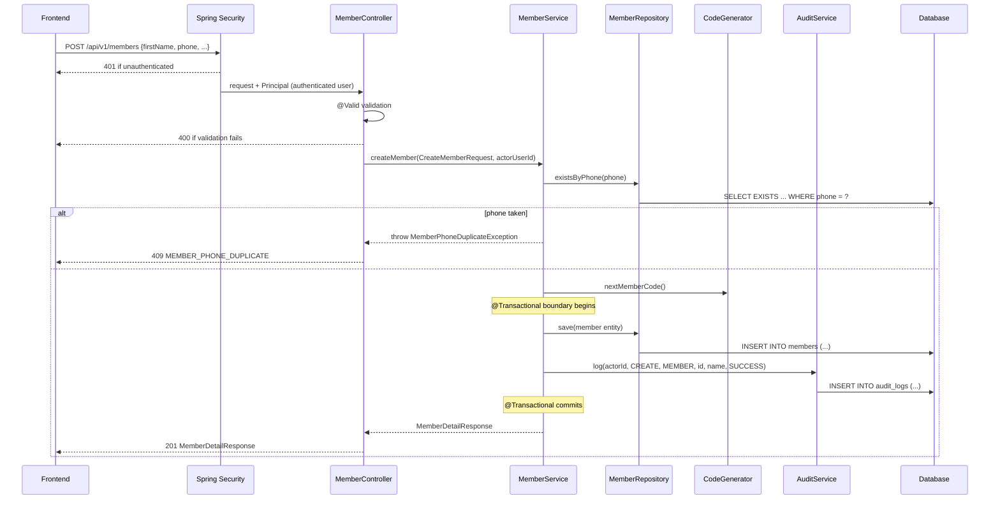
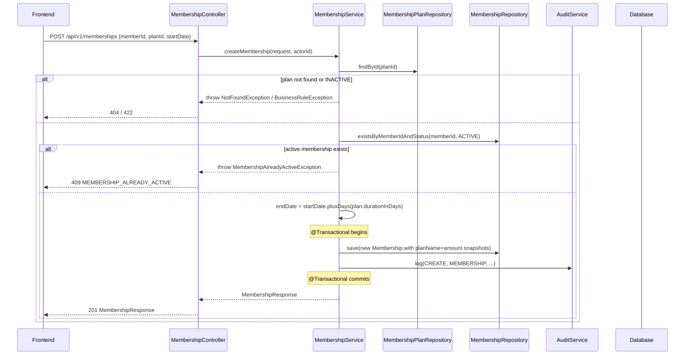
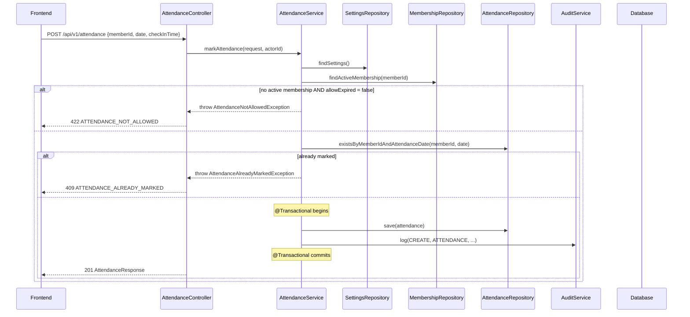
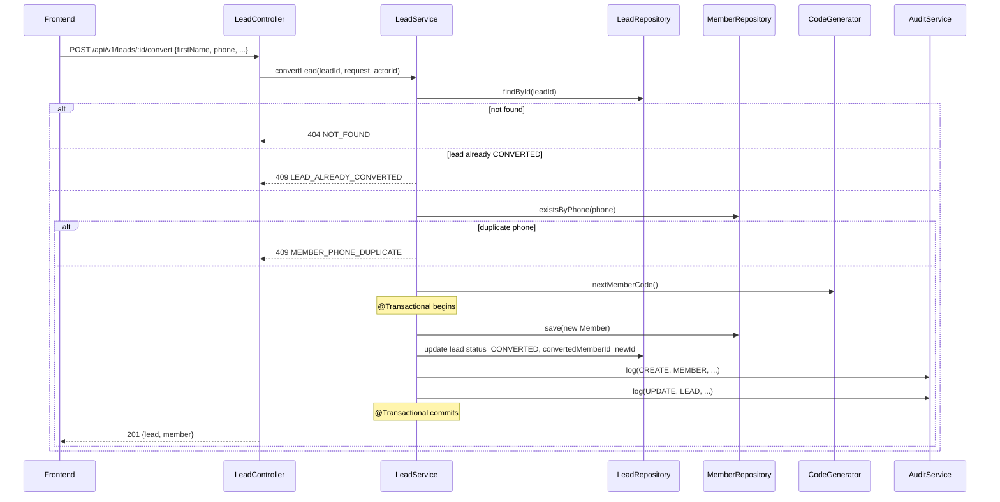
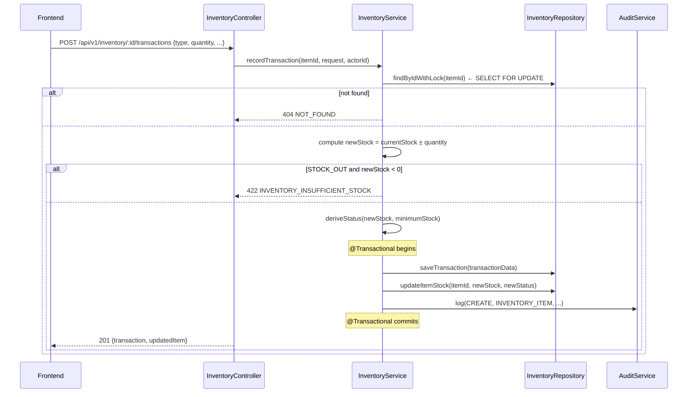

# 06 — Backend Low-Level Design (LLD)

## Technology

| Layer | Technology |
|---|---|
| Language | Java |
| Framework | Spring Boot |
| Persistence | Spring Data JPA / Hibernate |
| Validation | Jakarta Bean Validation (spring-boot-starter-validation) |
| Security | Spring Security |
| Scheduler | Spring `@Scheduled` |
| Build | **OPEN DECISION** (Maven or Gradle) |

---

## Package Structure

### Strategy: Package-by-Feature

The backend uses **package-by-feature** rather than package-by-layer.

**Why:** A package-by-layer layout (e.g., top-level `controller/`, `service/`, `repository/` containing all controllers/services) puts unrelated code together and related code apart. For a modular monolith, package-by-feature keeps all classes for a single domain concern in one place — making each feature independently understandable.

```
com.fitzone.gym
│
├── GymApplication.java                    ← @SpringBootApplication, main entry point
│
├── common/                                ← shared infrastructure; no domain logic
│   ├── audit/
│   │   ├── AuditService.java
│   │   ├── AuditAction.java               ← enum
│   │   └── AuditEntityType.java           ← enum
│   ├── codegen/
│   │   └── CodeGenerator.java             ← USR-001, MEM-001, etc.
│   ├── config/
│   │   ├── SecurityConfig.java            ← SecurityFilterChain bean
│   │   ├── WebMvcConfig.java              ← CORS, static resources
│   │   └── SchedulerConfig.java           ← task executor config
│   ├── exception/
│   │   ├── AppException.java              ← base runtime exception
│   │   ├── NotFoundException.java
│   │   ├── ConflictException.java
│   │   ├── ForbiddenException.java
│   │   └── GlobalExceptionHandler.java    ← @RestControllerAdvice
│   ├── pagination/
│   │   ├── PageResponse.java              ← generic paginated response wrapper
│   │   └── PaginationUtils.java
│   ├── response/
│   │   └── ApiError.java                  ← standard error response DTO
│   └── security/
│       ├── GymUserPrincipal.java          ← UserDetails impl
│       ├── UserDetailsServiceImpl.java    ← UserDetailsService impl
│       └── RolePermissions.java           ← role → permissions map
│
├── auth/
│   ├── AuthController.java
│   ├── AuthService.java
│   └── dto/
│       ├── LoginRequest.java
│       └── AuthUserResponse.java
│
├── user/
│   ├── UserController.java
│   ├── UserService.java
│   ├── UserRepository.java
│   ├── User.java                          ← @Entity
│   ├── UserRole.java                      ← @Enumerated enum
│   ├── UserStatus.java                    ← @Enumerated enum
│   └── dto/
│       ├── CreateUserRequest.java
│       ├── UpdateUserRequest.java
│       └── UserResponse.java
│
├── member/
│   ├── MemberController.java
│   ├── MemberService.java
│   ├── MemberRepository.java
│   ├── Member.java                        ← @Entity
│   ├── MemberStatus.java
│   └── dto/
│       ├── CreateMemberRequest.java
│       ├── UpdateMemberRequest.java
│       ├── MemberListItemResponse.java    ← list view (less data)
│       ├── MemberDetailResponse.java      ← full detail view
│       └── MemberSupplementalResponse.java
│
├── membershipplan/
│   ├── MembershipPlanController.java
│   ├── MembershipPlanService.java
│   ├── MembershipPlanRepository.java
│   ├── MembershipPlan.java
│   ├── PlanStatus.java
│   └── dto/
│       ├── CreateMembershipPlanRequest.java
│       ├── UpdateMembershipPlanRequest.java
│       └── MembershipPlanResponse.java
│
├── membership/
│   ├── MembershipController.java
│   ├── MembershipService.java
│   ├── MembershipRepository.java
│   ├── Membership.java
│   ├── MembershipStatus.java
│   └── dto/
│       ├── CreateMembershipRequest.java
│       └── MembershipResponse.java
│
├── payment/
│   ├── PaymentController.java
│   ├── PaymentService.java
│   ├── PaymentRepository.java
│   ├── Payment.java
│   ├── PaymentMethod.java
│   ├── PaymentStatus.java
│   └── dto/
│       ├── RecordPaymentRequest.java
│       └── PaymentResponse.java
│
├── attendance/
│   ├── AttendanceController.java
│   ├── AttendanceService.java
│   ├── AttendanceRepository.java
│   ├── Attendance.java
│   └── dto/
│       ├── MarkAttendanceRequest.java
│       └── AttendanceResponse.java
│
├── trainer/
│   ├── TrainerController.java
│   ├── TrainerService.java
│   ├── TrainerRepository.java
│   ├── Trainer.java
│   ├── TrainerStatus.java
│   └── dto/...
│
├── assignment/
│   ├── AssignmentController.java          ← nested under /members/:id/trainer
│   ├── AssignmentService.java
│   ├── AssignmentRepository.java
│   ├── MemberTrainerAssignment.java
│   ├── AssignmentStatus.java
│   └── dto/...
│
├── lead/
│   ├── LeadController.java
│   ├── LeadService.java
│   ├── LeadRepository.java
│   ├── Lead.java
│   ├── LeadStatus.java
│   ├── LeadSource.java
│   └── dto/...
│
├── expense/
│   ├── ExpenseController.java
│   ├── ExpenseCategoryController.java
│   ├── ExpenseService.java
│   ├── ExpenseRepository.java
│   ├── ExpenseCategoryRepository.java
│   ├── Expense.java
│   ├── ExpenseCategory.java
│   └── dto/...
│
├── inventory/
│   ├── InventoryController.java
│   ├── InventoryService.java
│   ├── InventoryRepository.java
│   ├── InventoryTransactionRepository.java
│   ├── InventoryItem.java
│   ├── InventoryTransaction.java
│   ├── InventoryStatus.java
│   ├── InventoryTransactionType.java
│   └── dto/...
│
├── equipment/
│   ├── EquipmentController.java
│   ├── EquipmentService.java
│   ├── EquipmentRepository.java
│   ├── EquipmentMaintenanceRepository.java
│   ├── Equipment.java
│   ├── EquipmentMaintenance.java
│   ├── EquipmentStatus.java
│   ├── MaintenanceType.java
│   └── dto/...
│
├── notification/
│   ├── NotificationController.java
│   ├── NotificationService.java
│   ├── NotificationRepository.java
│   ├── NotificationRecord.java
│   ├── NotificationType.java
│   ├── NotificationChannel.java
│   ├── NotificationStatus.java
│   ├── NotificationScheduler.java         ← @Scheduled expiry jobs
│   └── dto/...
│
├── report/
│   ├── ReportController.java
│   ├── ReportService.java
│   ├── ReportRepository.java              ← read-only aggregation queries
│   └── dto/...
│
├── settings/
│   ├── SettingsController.java
│   ├── SettingsService.java
│   ├── SettingsRepository.java
│   ├── GymSettings.java
│   └── dto/...
│
├── auditlog/
│   ├── AuditLogController.java            ← read-only
│   ├── AuditLogRepository.java
│   ├── AuditLog.java
│   └── dto/...
│
├── search/
│   ├── SearchController.java
│   ├── SearchService.java
│   └── dto/...
│
└── backup/
    ├── BackupController.java
    └── BackupService.java
```

---

## Layer Responsibilities

### @RestController

- Handles HTTP: parses path variables, query params, request body.
- Calls the service method with a request DTO.
- Returns `ResponseEntity<T>` with the appropriate status code.
- **No business logic**.
- **No direct repository calls**.
- Annotates methods with `@PreAuthorize` for permission enforcement.

### @Service

- Contains all business logic, domain rules, and workflow orchestration.
- Manages database transactions with `@Transactional`.
- Calls repository methods and maps entities to response DTOs.
- Calls `AuditService` to record significant actions.
- Throws domain exceptions (`NotFoundException`, `ConflictException`, etc.).

### @Repository (Spring Data JPA)

- Extends `JpaRepository<Entity, UUID>` or `JpaRepository<Entity, Long>`.
- Declares custom JPQL or native SQL queries for non-standard lookups.
- **No business logic**.
- Persistence only.

### @Entity

- JPA mapping only.
- No business methods, no service calls.
- Relationships declared with `@OneToMany`, `@ManyToOne`, etc.
- Use `@Enumerated(EnumType.STRING)` for all enums.

---

## DTO Architecture

JPA entities are **never** returned directly from controllers. The flow is:

```
Incoming JSON
    ↓
Request DTO     (@Valid for bean validation)
    ↓
Controller      (calls service with request DTO)
    ↓
Service         (maps request DTO → entity, applies business rules)
    ↓
Repository      (persists entity)
    ↓
Database

Database
    ↓
Entity          (fetched by repository)
    ↓
Service         (maps entity → response DTO)
    ↓
Controller      (returns ResponseEntity<ResponseDTO>)
    ↓
Response JSON
```

### DTO Naming Convention

| Type | Suffix | Example |
|---|---|---|
| Create input | `CreateXxxRequest` | `CreateMemberRequest` |
| Update input | `UpdateXxxRequest` | `UpdateMemberRequest` |
| List view output | `XxxListItemResponse` | `MemberListItemResponse` |
| Detail view output | `XxxDetailResponse` or `XxxResponse` | `MemberDetailResponse` |
| Nested sub-object | `XxxSummary` or `XxxInfo` | `MembershipSummary` |

### Mapping Strategy

**OPEN DECISION:** Manual mapping vs MapStruct.

| Option | Notes |
|---|---|
| **MapStruct** | Compile-time generated mappers, zero runtime overhead, type-safe | Add `mapstruct` dependency |
| **Manual mapping** | Explicit, no extra dependency, more verbose | Suitable for simple cases |

Recommendation: **MapStruct** for entities with many fields; manual mapping for simple ones.

Mappers live as `@Mapper`-annotated interfaces inside the feature package or in a dedicated `mapper/` sub-package.

---

## Validation

### Two Tiers of Validation

**Tier 1 — Request validation (Bean Validation on DTOs)**

Declared with annotations on DTO fields:

```java
// Conceptual — CreateMemberRequest

@NotBlank(message = "First name is required")
@Size(min = 2, max = 50, message = "First name must be 2–50 characters")
private String firstName;

@NotBlank(message = "Phone number is required")
@Pattern(regexp = "^\\d{10}$", message = "Enter a valid 10-digit phone number")
private String phone;

@Email(message = "Enter a valid email address")
private String email;  // nullable; @Email only validates if non-null

@Positive(message = "Amount must be greater than 0")
private BigDecimal amount;

@PastOrPresent(message = "Date of birth cannot be in the future")
private LocalDate dateOfBirth;

@Min(value = 1, message = "Duration must be at least 1 day")
private Integer durationInDays;
```

Activated by `@Valid` on the controller method parameter. Failures produce `400 Bad Request` via `MethodArgumentNotValidException`, handled by `GlobalExceptionHandler`.

**Tier 2 — Business validation (in Service layer)**

These rules cannot be expressed in DTO annotations because they depend on database state:

```
Member phone uniqueness            → SELECT from DB, throw ConflictException
One active membership per member   → query memberships table
Attendance duplicate check         → query attendance table
Inventory stock sufficiency check  → query current stock
Lead already converted             → check lead status
Inactive plan cannot be used       → check plan status
```

Service methods check these conditions and throw domain exceptions before any mutation.

---

## Exception Handling

### Domain Exception Hierarchy

```java
// Conceptual

public class AppException extends RuntimeException {
    private final String code;
    private final int httpStatus;
}

public class NotFoundException extends AppException {
    public NotFoundException(String code, String message) {
        super(code, 404, message);
    }
}

public class ConflictException extends AppException {
    public ConflictException(String code, String message) {
        super(code, 409, message);
    }
}

public class BusinessRuleException extends AppException {
    public BusinessRuleException(String code, String message) {
        super(code, 422, message);
    }
}

// Domain-specific subclasses:
public class MemberPhoneDuplicateException extends ConflictException { ... }
public class MembershipAlreadyActiveException extends ConflictException { ... }
public class AttendanceAlreadyMarkedException extends ConflictException { ... }
public class InsufficientStockException extends BusinessRuleException { ... }
public class LeadAlreadyConvertedException extends ConflictException { ... }
```

### Global Exception Handler

```java
// Conceptual

@RestControllerAdvice
public class GlobalExceptionHandler {

    @ExceptionHandler(AppException.class)
    public ResponseEntity<ApiError> handleAppException(AppException ex) {
        return ResponseEntity
            .status(ex.getHttpStatus())
            .body(new ApiError(ex.getHttpStatus(), ex.getCode(), ex.getMessage()));
    }

    @ExceptionHandler(MethodArgumentNotValidException.class)
    public ResponseEntity<ApiError> handleValidation(MethodArgumentNotValidException ex) {
        // collect field errors, return 400
    }

    @ExceptionHandler(AccessDeniedException.class)
    public ResponseEntity<ApiError> handleForbidden(AccessDeniedException ex) {
        return ResponseEntity.status(403)
            .body(new ApiError(403, "FORBIDDEN", "You do not have permission."));
    }

    @ExceptionHandler(Exception.class)
    public ResponseEntity<ApiError> handleGeneric(Exception ex) {
        log.error("Unhandled exception", ex);
        return ResponseEntity.status(500)
            .body(new ApiError(500, "INTERNAL_SERVER_ERROR", "An unexpected error occurred."));
    }
}
```

### Standard Error Response DTO

```java
public record ApiError(
    int status,
    String code,
    String message,
    Object details      // optional; null by default
) {}
```

Matches the frontend `ApiErrorData` interface.

---

## Transaction Management

`@Transactional` is placed **on service methods**, not repositories or controllers.

Rules:
- Every service method that mutates data and must be atomic is annotated `@Transactional`.
- Read-only methods are annotated `@Transactional(readOnly = true)` for Hibernate query optimization.
- No `@Transactional` on controllers.
- No `@Transactional` on repositories (Spring Data JPA handles single-operation transactions by default).

### Operations requiring explicit `@Transactional`

| Service method | Tables involved |
|---|---|
| `MembershipService.createMembership()` | `memberships` INSERT + `audit_logs` INSERT |
| `PaymentService.recordPayment()` | `payments` INSERT + `audit_logs` INSERT |
| `AttendanceService.markAttendance()` | `attendance` INSERT + `audit_logs` INSERT |
| `AssignmentService.assignTrainer()` | `assignments` UPDATE (end) + INSERT (new) + `audit_logs` INSERT |
| `LeadService.convertLead()` | `leads` UPDATE + `members` INSERT + `audit_logs` INSERT ×2 |
| `InventoryService.recordTransaction()` | `inventory_transactions` INSERT + `inventory_items` UPDATE + `audit_logs` INSERT |
| `MemberService.createMember()` | `members` INSERT + `audit_logs` INSERT |
| `UserService.createUser()` | `users` INSERT + `audit_logs` INSERT |
| `SettingsService.save()` | `gym_settings` UPDATE + `audit_logs` INSERT |

---

## JPA / Hibernate Design Notes

### Entity Relationships

Design unidirectional relationships where bidirectional is not needed for queries. Bidirectional relationships add complexity (maintain both sides, risk of infinite recursion in serialization).

```java
// Conceptual — Membership entity

@Entity
@Table(name = "memberships")
public class Membership {

    @Id
    @GeneratedValue(strategy = GenerationType.UUID)
    private UUID id;

    @ManyToOne(fetch = FetchType.LAZY)   // always LAZY for @ManyToOne
    @JoinColumn(name = "member_id", nullable = false)
    private Member member;

    @ManyToOne(fetch = FetchType.LAZY)
    @JoinColumn(name = "plan_id", nullable = false)
    private MembershipPlan plan;

    @Column(name = "plan_name", nullable = false)
    private String planName;             // snapshot

    @Column(name = "start_date", nullable = false)
    private LocalDate startDate;

    @Column(name = "end_date", nullable = false)
    private LocalDate endDate;

    @Column(name = "amount", nullable = false)
    private BigDecimal amount;           // snapshot

    @Enumerated(EnumType.STRING)
    @Column(nullable = false)
    private MembershipStatus status;

    @CreationTimestamp
    private Instant createdAt;
}
```

### Fetch Strategy

- `@ManyToOne`: always `FetchType.LAZY` (default is EAGER — override it explicitly).
- `@OneToMany`: always `FetchType.LAZY` (this is the default).
- Never use `FetchType.EAGER` unless profiling proves a specific case requires it.

### N+1 Problem Prevention

When a controller returns a list of entities that require related data (e.g., member list with trainer name), use a JPQL `JOIN FETCH` or `@EntityGraph`:

```java
// In MemberRepository — fetch with current membership in one query
@Query("SELECT m FROM Member m LEFT JOIN FETCH m.activeMembership WHERE ...")
List<Member> findAllWithActiveMembership(Pageable pageable);
```

Alternatively, use projection DTOs (JPQL constructor expressions) for list endpoints to avoid loading full entity graphs.

### Enum Mapping

All enums must be stored as strings in the database:

```java
@Enumerated(EnumType.STRING)
@Column(nullable = false)
private MemberStatus status;
```

Never use `EnumType.ORDINAL` — ordinal values break when enum order changes.

### Unique Constraints

Database-level unique constraints are defined both in the schema (Flyway migration) and on the entity:

```java
// Conceptual
@Table(name = "members", uniqueConstraints = {
    @UniqueConstraint(name = "uq_member_phone", columnNames = "phone"),
    @UniqueConstraint(name = "uq_member_code", columnNames = "member_code")
})
```

### Audit Timestamps

Use Hibernate `@CreationTimestamp` and `@UpdateTimestamp` for automatic timestamp management:

```java
@CreationTimestamp
@Column(name = "created_at", nullable = false, updatable = false)
private Instant createdAt;

@UpdateTimestamp
@Column(name = "updated_at", nullable = false)
private Instant updatedAt;
```

### Cascade

Use cascade sparingly and only where the parent genuinely owns the child:
- `CascadeType.PERSIST` on `Equipment` → `EquipmentMaintenance` is not appropriate (maintenance is added independently).
- Cascade is generally **not used** in this domain — all entities are managed independently.
- `orphanRemoval` is not used — no child is automatically deleted when removed from a parent collection.

---

## Audit Service

The `AuditService` is a shared service in `common/audit/` used by all feature services:

```java
// Conceptual

@Service
public class AuditService {

    public void log(
        UUID userId,
        AuditAction action,
        AuditEntityType entityType,
        String entityId,
        String entityName,
        String description,
        AuditStatus status,
        Map<String, Object> metadata
    ) {
        AuditLog entry = new AuditLog(...);
        auditLogRepository.save(entry);
    }
}
```

The audit log write happens **inside the same `@Transactional` context** as the primary operation. If the primary operation is rolled back, the audit log write is also rolled back.

---

## Code Generator

```java
// Conceptual — common/codegen/CodeGenerator.java

@Service
public class CodeGenerator {

    // Uses a database sequence (or a counter table) to generate unique, sequential codes.
    public String nextMemberCode()   { return generate("MEM-", "member_code_seq"); }
    public String nextUserCode()     { return generate("USR-", "user_code_seq"); }
    public String nextTrainerCode()  { return generate("TRN-", "trainer_code_seq"); }
    public String nextLeadCode()     { return generate("LEAD-", "lead_code_seq"); }
    public String nextExpenseCode()  { return generate("EXP-", "expense_code_seq"); }
    public String nextItemCode()     { return generate("INV-", "item_code_seq"); }
    public String nextEquipCode()    { return generate("EQ-", "equipment_code_seq"); }

    private String generate(String prefix, String sequence) {
        Long n = (Long) em.createNativeQuery(
            "SELECT nextval('" + sequence + "')"
        ).getSingleResult();
        return prefix + String.format("%03d", n);
    }
}
```

---

## Scheduled Jobs

```java
// Conceptual — notification/NotificationScheduler.java

@Component
public class NotificationScheduler {

    @Scheduled(cron = "0 0 0 * * ?", zone = "Asia/Kolkata")
    @Transactional
    public void expireMemberships() {
        // find ACTIVE memberships where end_date < today (IST)
        // update status to EXPIRED
        // update member.status if no remaining active membership
        // write audit logs
    }

    @Scheduled(cron = "0 0 9 * * ?", zone = "Asia/Kolkata")
    public void sendExpiryNotifications() {
        // find memberships expiring in 7 days
        // create notification records
        // dispatch via configured channels
    }
}
```

No external job queue is needed. `@EnableScheduling` is placed on the application class or a `@Configuration` class.

---

## Sequence Diagrams

### Create Member



---

### Create Membership



---

### Mark Attendance



---

### Convert Lead to Member



---

### Inventory Stock Transaction



---

## Testing Strategy

### Unit Tests

Test service business logic in isolation using Mockito:

```java
@ExtendWith(MockitoExtension.class)
class MembershipServiceTest {

    @InjectMocks
    private MembershipService membershipService;

    @Mock
    private MembershipRepository membershipRepository;

    @Mock
    private AuditService auditService;

    @Test
    void createMembership_whenActiveMembershipExists_throwsConflict() {
        when(membershipRepository.existsByMemberIdAndStatus(any(), eq(ACTIVE)))
            .thenReturn(true);

        assertThrows(MembershipAlreadyActiveException.class,
            () -> membershipService.createMembership(request, actorId));
    }
}
```

**What to unit test:**
- Business rules in services.
- Derived computations (endDate = startDate + plan.durationInDays).
- Exception conditions.
- Permission guard logic.

### Repository / Persistence Tests

Use `@DataJpaTest` (loads only JPA layer, uses H2 in-memory database):

```java
@DataJpaTest
class AttendanceRepositoryTest {

    @Test
    void existsByMemberIdAndAttendanceDate_whenRecordExists_returnsTrue() {
        // insert attendance, then check uniqueness
    }

    @Test
    void uniqueConstraint_preventsDuplicateAttendance() {
        // insert same member+date twice → expect DataIntegrityViolationException
    }
}
```

**What to test:**
- Custom JPQL queries return correct results.
- Unique constraints fire as expected.
- Partial indexes enforce one-active-membership / one-active-assignment.

### Controller / API Tests

Use `@WebMvcTest` (loads only web layer, mocks service):

```java
@WebMvcTest(MemberController.class)
class MemberControllerTest {

    @MockBean
    private MemberService memberService;

    @Test
    void createMember_withInvalidPhone_returns400() {
        mockMvc.perform(post("/api/v1/members")
            .contentType(APPLICATION_JSON)
            .content("{\"phone\":\"123\"}"))  // invalid
            .andExpect(status().isBadRequest())
            .andExpect(jsonPath("$.code").value("VALIDATION_ERROR"));
    }

    @Test
    void createMember_withoutAuthentication_returns401() { ... }

    @Test
    void createMember_withReceptionistRole_returns201() { ... }

    @Test
    void deleteMember_withReceptionistRole_returns403() { ... }
}
```

**What to test:**
- Request validation (400 on invalid input).
- Authentication (401 without credentials).
- Authorization (403 with wrong role).
- Response shape matches expected DTO.

### Integration Tests

Use `@SpringBootTest` with a real (test) database:

```java
@SpringBootTest
@Transactional   // roll back after each test
class CreateMembershipIntegrationTest {

    @Test
    void createMembership_full_flow() {
        // create member via API
        // create membership via API
        // verify response + database state
    }

    @Test
    void createMembership_whenActiveAlreadyExists_returns409() { ... }
}
```

Integration tests exercise the full stack: Controller → Service → Repository → Database.

### Test Database

- Unit tests: pure Java, no Spring context.
- `@DataJpaTest`: H2 in-memory.
- `@WebMvcTest`: H2 or mocked repositories.
- `@SpringBootTest` integration tests: H2 in-memory or a dedicated test PostgreSQL (via Testcontainers).

**OPEN DECISION:** Whether to use Testcontainers for integration tests (provides real PostgreSQL in Docker). Recommended for constraint testing that H2 does not replicate perfectly.
