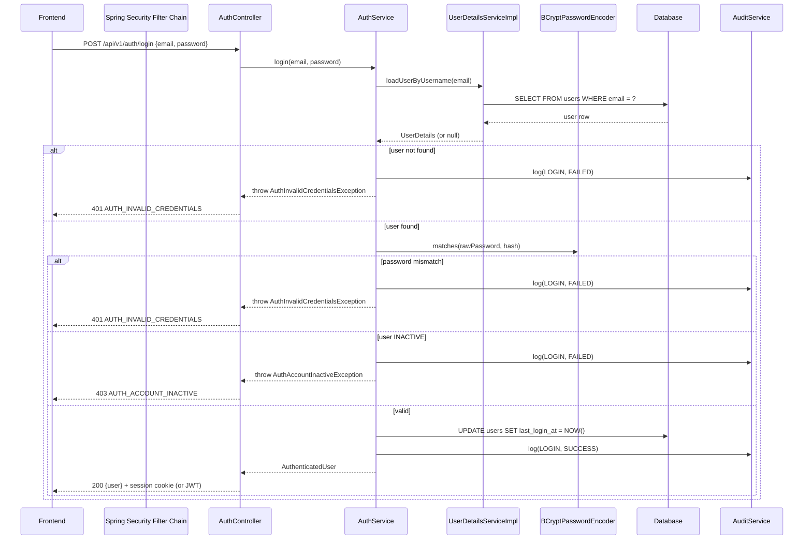

# 07 — Authentication & Security

## Spring Security Overview

Authentication and authorization are implemented using **Spring Security**. Spring Security integrates with Spring Boot via auto-configuration and provides:

- A filter chain that intercepts all requests before they reach controllers.
- Pluggable authentication mechanisms (session, JWT, OAuth2, etc.).
- Method-level authorization via `@PreAuthorize`.
- Password encoding via `PasswordEncoder`.

The `SecurityFilterChain` is the central configuration point.

---

## Authentication

### OPEN DECISION: Authentication Transport

Two strategies are available under Spring Security:

**Option A — HTTP-only Cookie + Server-Side Session**
- Spring Security's default session-based authentication.
- On login: server creates a session, sets `JSESSIONID` HTTP-only cookie.
- On each request: Spring validates the session from the cookie.
- Logout: server invalidates the session.
- CSRF protection required (Spring Security provides it automatically for session-based auth).
- Session stored in memory (JVM) or externally (Redis, DB table `spring_session`).
- Works naturally for same-origin LAN deployments where frontend and backend share the same origin.
- Simplest Spring Security setup — no token management code needed.

**Option B — JWT (JSON Web Token)**
- On login: server issues a signed JWT returned in the response body.
- Client stores the JWT (localStorage or in-memory) and sends it as `Authorization: Bearer <token>`.
- Server validates the JWT signature on each request — stateless.
- No CSRF risk (not cookie-based), but requires refresh token logic if long sessions are needed.
- Slightly more implementation complexity (JWT filter, key management).
- Better for multi-client setups (mobile app + web); not a strong advantage for a LAN-only system.

**Recommendation:** Option A (session-based) for simplicity on a LAN system. Option B if there is a future need for a mobile app or REST API clients outside the browser.

This decision must be made before Phase 3 implementation. Until resolved, the architecture design remains compatible with either.

---

### Login Flow



### Logout

- `POST /api/v1/auth/logout`
- If session-based: `SecurityContextHolder.clearContext()` + invalidate HTTP session.
- If JWT: client discards token; optionally add token to a server-side blocklist.
- Audit log written on logout.

### Current User

- `GET /api/v1/auth/me`
- Retrieves authenticated user from `SecurityContextHolder.getContext().getAuthentication()`.
- Returns the user profile (no `passwordHash`).

---

## Spring Security Configuration

### SecurityFilterChain

```java
// Conceptual — not final implementation

@Configuration
@EnableWebSecurity
@EnableMethodSecurity   // enables @PreAuthorize
public class SecurityConfig {

    @Bean
    public SecurityFilterChain filterChain(HttpSecurity http) throws Exception {
        http
            .csrf(...)                          // configure based on session vs JWT choice
            .sessionManagement(...)             // configure based on session vs JWT choice
            .authorizeHttpRequests(auth -> auth
                .requestMatchers("/api/v1/auth/login").permitAll()
                .requestMatchers("/health").permitAll()
                .anyRequest().authenticated()    // all other endpoints require authentication
            )
            .addFilterBefore(...)               // JWT filter if JWT is chosen
            .exceptionHandling(ex -> ex
                .authenticationEntryPoint(...)  // returns 401 JSON response
                .accessDeniedHandler(...)       // returns 403 JSON response
            );
        return http.build();
    }

    @Bean
    public PasswordEncoder passwordEncoder() {
        return new BCryptPasswordEncoder(12);
    }
}
```

### UserDetailsService

A `UserDetailsServiceImpl` loads users from the database by email for Spring Security's authentication process:

```java
// Conceptual

@Service
public class UserDetailsServiceImpl implements UserDetailsService {

    @Override
    public UserDetails loadUserByUsername(String email) throws UsernameNotFoundException {
        User user = userRepository.findByEmail(email)
            .orElseThrow(() -> new UsernameNotFoundException(email));
        return new GymUserPrincipal(user);   // wraps User entity as UserDetails
    }
}
```

`GymUserPrincipal` wraps the `User` entity and implements `UserDetails`. It exposes:
- `getUsername()` → email
- `getPassword()` → passwordHash
- `isEnabled()` → `user.status == ACTIVE`
- `getAuthorities()` → single authority based on role (e.g., `ROLE_OWNER`)

---

## Authorization

### Role-Based Permission Model

The frontend defines four roles (`OWNER`, `ADMIN`, `RECEPTIONIST`, `TRAINER`) and 40+ specific permissions (e.g., `members:create`, `payments:record`). The backend must mirror this model.

**Implementation strategy:**

The backend defines a `Permission` enum matching the frontend's permission strings. A `PermissionEvaluator` or static `rolePermissions` map resolves which permissions a role has.

**Option A — Spring Security authorities (simple)**
- Store all permissions as `GrantedAuthority` objects in `GymUserPrincipal`.
- Use `@PreAuthorize("hasAuthority('members:create')")` on service methods or controllers.
- Pros: Built into Spring Security, no custom code.
- Cons: Authority strings must exactly match; verbose on classes with many methods.

**Option B — Custom `@RequiresPermission` annotation + AOP**
- Define a custom annotation: `@RequiresPermission("members:create")`.
- An AOP aspect or method interceptor checks the permission.
- Pros: Cleaner API.
- Cons: More setup.

**Recommendation:** Option A using Spring's built-in `@PreAuthorize` — sufficient for this system and requires no custom infrastructure.

### Method-Level Authorization

```java
// Conceptual — on controller or service methods

@PreAuthorize("hasAuthority('members:create')")
public ResponseEntity<MemberResponse> createMember(...) { ... }

@PreAuthorize("hasAuthority('members:delete')")
public ResponseEntity<Void> deleteMember(...) { ... }

@PreAuthorize("hasAuthority('settings:edit')")
public ResponseEntity<GymSettingsResponse> saveSettings(...) { ... }
```

`@EnableMethodSecurity` (replacing deprecated `@EnableGlobalMethodSecurity`) must be set on the security config class.

### Permission Loading at Login

When `GymUserPrincipal` is constructed, authorities are populated from the role:

```java
// Conceptual

public Collection<GrantedAuthority> getAuthorities() {
    return RolePermissions.getPermissions(user.getRole())
        .stream()
        .map(SimpleGrantedAuthority::new)
        .collect(Collectors.toList());
}
```

`RolePermissions` is a static map mirroring `frontend/src/features/auth/permissions/permissions.ts`. It must be kept in sync with the frontend definition.

### Authorization Principle

```
Frontend permission check → UX (hides buttons, blocks navigation)
Backend @PreAuthorize    → actual security boundary
```

The backend does not trust that the frontend has correctly enforced permissions. Every protected endpoint verifies authorization server-side before any database operation.

---

## Full Permission Matrix

```
Permission                   OWNER   ADMIN   RECEPTIONIST   TRAINER
─────────────────────────────────────────────────────────────────────
dashboard:view                 ✓       ✓           ✓           ✓
members:view                   ✓       ✓           ✓           ✓
members:create                 ✓       ✓           ✓
members:edit                   ✓       ✓           ✓
members:delete                 ✓       ✓
memberships:view               ✓       ✓           ✓           ✓
memberships:create             ✓       ✓           ✓
membership-plans:view          ✓       ✓           ✓
membership-plans:create        ✓       ✓
membership-plans:edit          ✓       ✓
membership-plans:delete        ✓       ✓
attendance:view                ✓       ✓           ✓           ✓
attendance:mark                ✓       ✓           ✓           ✓
payments:view                  ✓       ✓           ✓
payments:record                ✓       ✓           ✓
trainers:view                  ✓       ✓           ✓           ✓
trainers:create                ✓       ✓
trainers:edit                  ✓       ✓
trainers:delete                ✓       ✓
leads:view                     ✓       ✓           ✓
leads:create                   ✓       ✓           ✓
leads:edit                     ✓       ✓           ✓
leads:delete                   ✓       ✓
expenses:view                  ✓       ✓
expenses:create                ✓       ✓
expenses:edit                  ✓       ✓
expenses:delete                ✓       ✓
inventory:view                 ✓       ✓           ✓
inventory:create               ✓       ✓
inventory:edit                 ✓       ✓
inventory:delete               ✓       ✓
equipment:view                 ✓       ✓
equipment:create               ✓       ✓
equipment:edit                 ✓       ✓
equipment:delete               ✓       ✓
equipment:maintenance          ✓       ✓
reports:view                   ✓       ✓
users:view                     ✓       ✓
users:create                   ✓       ✓
users:edit                     ✓       ✓
users:delete                   ✓
settings:view                  ✓       ✓
settings:edit                  ✓
notifications:view             ✓       ✓           ✓           ✓
notifications:create           ✓       ✓           ✓
audit-logs:view                ✓       ✓
profile:view                   ✓       ✓           ✓           ✓
profile:update                 ✓       ✓           ✓           ✓
```

---

## Security Controls

### Password Hashing

```java
@Bean
public PasswordEncoder passwordEncoder() {
    return new BCryptPasswordEncoder(12);  // cost factor 12
}
```

- All passwords are stored as bcrypt hashes.
- The raw password never appears in logs, responses, or audit records.
- Mock plain-text passwords in `auth.mock.ts` must never reach production.

### Input Validation

Request DTOs are annotated with Jakarta Bean Validation constraints (`@NotNull`, `@Email`, `@Size`, etc.) and validated with `@Valid` in controller method parameters. Invalid requests return `400 Bad Request` before reaching the service.

### SQL Injection Protection

Spring Data JPA uses parameterized queries by default. JPQL and Criteria API are parameterized. No string concatenation into SQL queries is permitted.

### Rate Limiting

Apply rate limiting on `POST /api/v1/auth/login` to prevent brute-force. Options:
- Spring Boot + Bucket4j (token bucket algorithm, no external dependency).
- Nginx-level rate limiting (if Nginx is used as a reverse proxy).

**OPEN DECISION:** Rate limiting implementation approach.

### CORS

Spring Security's CORS configuration should allow only the frontend origin:

```java
// Conceptual
configuration.setAllowedOrigins(List.of(frontendOrigin));
configuration.setAllowedMethods(List.of("GET", "POST", "PATCH", "PUT", "DELETE", "OPTIONS"));
configuration.setAllowCredentials(true);  // required if using session cookies
```

### CSRF

- **Session-based auth:** Spring Security's CSRF protection is enabled by default. Frontend must include the CSRF token in state-changing requests (Spring Security provides it via a cookie or header mechanism).
- **JWT auth:** CSRF protection can be disabled (`http.csrf().disable()`) since the `Authorization: Bearer` header mechanism is not vulnerable to CSRF.

### Secrets Management

All secrets (session secret, JWT key, DB password) are provided via environment variables and loaded through Spring's `@ConfigurationProperties` or `@Value`. No secrets in source code or committed config files.

### Sensitive Data in Responses

- The `passwordHash` field on the `User` entity must **never** appear in any API response DTO.
- `MemberResponse` and `MemberListItemResponse` must not expose sensitive fields (emergency contact details, address) in list endpoints — only in the detail endpoint.

### HTTPS

**OPEN DECISION:** Whether to configure HTTPS on LAN (self-signed certificate or local CA). Even on LAN, HTTPS prevents credential interception. Spring Boot supports SSL configuration via `server.ssl.*` properties.

### Audit Log Write Protection

The application's database user should not have `DELETE` privilege on the `audit_logs` table. This is an additional defense layer (application-level logic already forbids deletes, but DB-level enforcement is stronger).

---

## Authentication Integration Contract (for Frontend)

The `AuthTransport` interface in `src/lib/api/auth.ts` must be implemented to call the real backend. The interface methods map to:

| Method | Backend endpoint |
|---|---|
| `login(email, password)` | `POST /api/v1/auth/login` |
| `logout()` | `POST /api/v1/auth/logout` |
| `getCurrentUserId()` | `GET /api/v1/auth/me` |
| `refreshSession()` | Depends on auth transport choice |

The `apiClient` in `src/lib/api/client.ts` must be updated to:
- Send session cookies automatically (if session-based: `credentials: 'include'` in fetch).
- Send `Authorization: Bearer <token>` header (if JWT).
- Intercept `401` responses to trigger logout/redirect.
