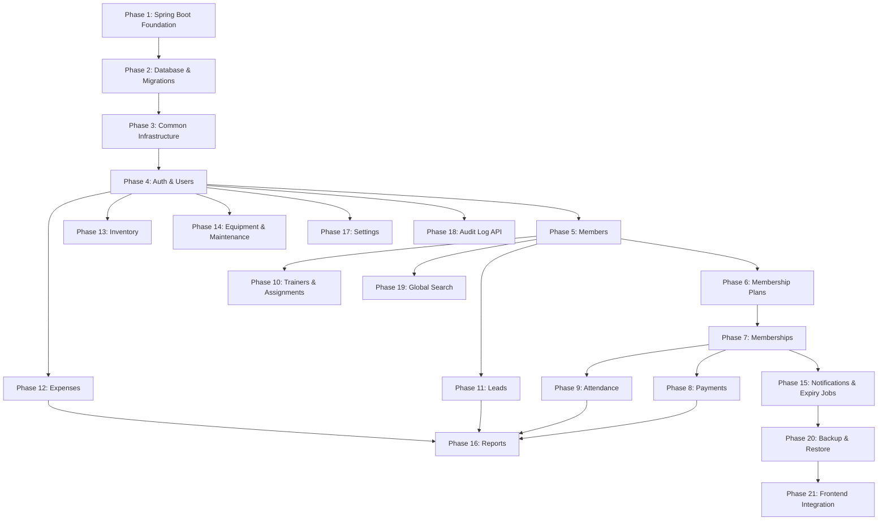

# 10 — Backend Development Plan

## Technology Baseline

```
Language:           Java
Framework:          Spring Boot
Architecture:       Modular Monolith
API:                REST
Persistence:        Spring Data JPA / Hibernate
Database:           OPEN DECISION (PostgreSQL recommended)
Migration tool:     OPEN DECISION (Flyway recommended)
Authentication:     Spring Security — OPEN DECISION (session-based vs JWT)
API documentation:  Springdoc OpenAPI (proposed)
Testing:            JUnit 5 + Mockito + Spring Boot Test
Build tool:         OPEN DECISION (Maven or Gradle)
```

---

## Implementation Dependency Graph



---

## Phase 1 — Spring Boot Foundation

**Objective:** Bootstrapped, buildable Spring Boot project with no domain code yet.

**Work:**
- Initialize Spring Boot project (Spring Initializr or manually):
  - Dependencies: `spring-boot-starter-web`, `spring-boot-starter-data-jpa`, `spring-boot-starter-security`, `spring-boot-starter-validation`, `spring-boot-starter-test`
  - **OPEN DECISION:** Maven (`pom.xml`) or Gradle (`build.gradle`)
  - **OPEN DECISION:** Java 17 or Java 21 (both are LTS; 21 recommended)
- Configure application properties (`application.yml` or `application.properties`):
  - Server port (`server.port=8080`)
  - Active profile (`spring.profiles.active=dev`)
  - Logging levels
- Set up multi-profile configuration (`application-dev.yml`, `application-prod.yml`).
- Implement `GET /health` endpoint (no authentication required).
- Configure global CORS policy.
- Basic logging configuration (Logback).
- Establish the project package structure: `com.fitzone.gym`.

**Completion criteria:**
- `./mvnw spring-boot:run` (or `./gradlew bootRun`) starts without errors.
- `GET /health` returns `200 { "status": "ok" }`.
- Application loads with empty Spring Security config (all requests allowed temporarily).

---

## Phase 2 — Database & Migrations

**Objective:** All database tables, types, constraints, and indexes created via versioned migrations.

**Dependencies:** Phase 1

**Work:**
- Add database driver dependency:
  - **OPEN DECISION:** PostgreSQL (`postgresql`) or MySQL (`mysql-connector-j`)
- Add migration tool:
  - **OPEN DECISION:** Flyway (`flyway-core`) or Liquibase (`liquibase-core`)
  - Configure `spring.flyway.locations=classpath:db/migration`
- Write migration files in dependency order:
  1. `V1__create_enum_types.sql` — all PostgreSQL enum types
  2. `V2__create_users.sql`
  3. `V3__create_gym_settings.sql` + seed row
  4. `V4__create_members.sql`
  5. `V5__create_membership_plans.sql`
  6. `V6__create_memberships.sql` + partial unique index
  7. `V7__create_payments.sql`
  8. `V8__create_attendance.sql` + unique constraint
  9. `V9__create_trainers.sql`
  10. `V10__create_member_trainer_assignments.sql` + partial unique index
  11. `V11__create_leads.sql`
  12. `V12__create_expense_categories.sql`
  13. `V13__create_expenses.sql`
  14. `V14__create_inventory_categories.sql`
  15. `V15__create_inventory_items.sql`
  16. `V16__create_inventory_transactions.sql`
  17. `V17__create_equipment_categories.sql`
  18. `V18__create_equipment.sql`
  19. `V19__create_equipment_maintenance.sql`
  20. `V20__create_notification_records.sql`
  21. `V21__create_audit_logs.sql`
  22. `V22__create_code_sequences.sql` — all `_code_seq` sequences
- Configure H2 for test profile (`application-test.yml`).

**Completion criteria:**
- `Flyway: Successfully applied 22 migrations` in logs on startup.
- All tables exist with correct columns, types, constraints.
- Partial unique indexes exist and can be verified.
- H2 in-memory works for test profile.

---

## Phase 3 — Common Infrastructure

**Objective:** Shared utilities and infrastructure that all feature modules will depend on.

**Dependencies:** Phase 2

**Work:**
- **`common/exception/`**:
  - `AppException` base class.
  - `NotFoundException`, `ConflictException`, `BusinessRuleException`, `ForbiddenException`.
  - All domain-specific exceptions (see `06-backend-lld.md`).
  - `GlobalExceptionHandler` (`@RestControllerAdvice`).
- **`common/response/`**:
  - `ApiError` record.
  - `PageResponse<T>` + `PageMeta` record.
- **`common/pagination/`**:
  - `PaginationUtils` helper.
- **`common/audit/`**:
  - `AuditService` with `log(...)` method.
  - `AuditLog` entity + `AuditLogRepository`.
  - `AuditAction` and `AuditEntityType` enums.
- **`common/codegen/`**:
  - `CodeGenerator` service — uses DB sequences to generate `USR-001`, `MEM-001`, etc.
- **`common/security/`**:
  - `GymUserPrincipal` (implements `UserDetails`).
  - `UserDetailsServiceImpl` stub (full implementation in Phase 4).
  - `RolePermissions` static map.
  - `SecurityConfig` with `SecurityFilterChain` bean (temporarily permitting all requests for development).

**Tests:**
- `GlobalExceptionHandler` maps `NotFoundException` → 404 with correct body.
- `GlobalExceptionHandler` maps validation failure → 400 with field errors.
- `CodeGenerator` generates correct formatted codes.

**Completion criteria:**
- All common infrastructure compiles and unit tests pass.
- `ApiError` shape matches the frontend `ApiErrorData` interface.

---

## Phase 4 — Authentication & Users

**Objective:** Working login/logout, session management, and user CRUD. Gate for all other features.

**Dependencies:** Phase 3

**Entities:** `User`

**Migrations:** Already created in Phase 2.

**APIs implemented:**
- `POST /api/v1/auth/login`
- `POST /api/v1/auth/logout`
- `GET /api/v1/auth/me`
- `PATCH /api/v1/auth/profile`
- `GET /api/v1/users` (paginated, filter by role/status)
- `GET /api/v1/users/:id`
- `POST /api/v1/users`
- `PATCH /api/v1/users/:id`
- `DELETE /api/v1/users/:id`

**Business logic:**
- BCrypt password hashing (`BCryptPasswordEncoder(12)`).
- **OPEN DECISION:** Finalize session vs JWT and implement chosen strategy.
- `UserDetailsServiceImpl` complete implementation.
- `SecurityConfig` `SecurityFilterChain` with full auth rules.
- `@PreAuthorize` on all user management endpoints.
- INACTIVE user login rejection.
- `lastLoginAt` update on login.
- User code generation (`USR-NNN`).
- Audit log for LOGIN, LOGOUT, CREATE, UPDATE, DELETE.

**DTOs:**
- `LoginRequest`, `AuthUserResponse`
- `CreateUserRequest`, `UpdateUserRequest`, `UserResponse`

**Tests:**
- Login with valid credentials → 200 + session/JWT.
- Login with wrong password → 401.
- Login with INACTIVE user → 403.
- Access protected endpoint without session → 401.
- RECEPTIONIST cannot access `POST /users` → 403.
- OWNER can delete user; ADMIN cannot → 403.
- Create user with duplicate email → 409.

**Completion criteria:**
- Login/logout work end-to-end.
- All 4 roles can authenticate; permission checks fire correctly.
- User CRUD works for all permitted roles.

---

## Phase 5 — Members

**Objective:** Core member management.

**Dependencies:** Phase 4

**Entity:** `Member`

**APIs implemented:**
- `GET /api/v1/members` (paginated, search, status filter)
- `GET /api/v1/members/:id`
- `GET /api/v1/members/:id/details` (skeleton — returns empty supplemental data until Phase 7+)
- `POST /api/v1/members`
- `PATCH /api/v1/members/:id`
- `DELETE /api/v1/members/:id`

**Business logic:**
- Phone uniqueness (service check + DB constraint).
- Phone format validation (`@Pattern`).
- DOB past-date validation (`@PastOrPresent`).
- Member code generation (`MEM-NNN`).
- Audit log for CREATE, UPDATE, DELETE.

**DTOs:** `CreateMemberRequest`, `UpdateMemberRequest`, `MemberListItemResponse`, `MemberDetailResponse`

**Tests:**
- Duplicate phone → 409.
- Future DOB → 400.
- Delete member with no dependents → 204.
- Delete member with memberships → 409 (FK).
- Search by name, phone, memberCode returns correct results.

---

## Phase 6 — Membership Plans

**Objective:** Plan catalog management.

**Dependencies:** Phase 4 (auth only)

**Entity:** `MembershipPlan`

**APIs implemented:**
- `GET /api/v1/membership-plans`
- `GET /api/v1/membership-plans/:id`
- `POST /api/v1/membership-plans`
- `PATCH /api/v1/membership-plans/:id`
- `DELETE /api/v1/membership-plans/:id`

**Business logic:**
- `@Min(1)` on `durationInDays`.
- `@Positive` on `price`.
- Delete blocked when active memberships reference the plan.

**Tests:**
- `durationInDays = 0` → 400.
- `price = 0` → 400.
- Delete plan with referenced memberships → 409.
- INACTIVE plan cannot be used in membership creation (Phase 7).

---

## Phase 7 — Memberships

**Objective:** Core member subscription lifecycle.

**Dependencies:** Phases 5 (members) + 6 (plans)

**Entity:** `Membership`

**APIs implemented:**
- `GET /api/v1/memberships` (paginated, filter by status/memberId)
- `GET /api/v1/memberships/:id`
- `POST /api/v1/memberships`

**Business logic:**
- `endDate` = `startDate.plusDays(plan.durationInDays)`.
- Snapshot `planName` and `amount` at creation.
- One-active-membership enforcement (partial unique index + service check).
- `@Transactional`: membership INSERT + audit INSERT.

**Tests:**
- Create membership → correct `endDate`.
- Create second active membership → 409.
- Using INACTIVE plan → 422.
- `GET /members/:id/details` now includes membership history.

---

## Phase 8 — Payments

**Objective:** Financial transaction recording.

**Dependencies:** Phase 7 (memberships)

**Entity:** `Payment`

**APIs implemented:**
- `GET /api/v1/payments` (paginated, filters)
- `GET /api/v1/payments/:id`
- `POST /api/v1/payments`

**Business logic:**
- `@Positive` on `amount`.
- Standalone payment (no `membershipId`) is valid.
- `@Transactional`: payment INSERT + audit INSERT.

**Tests:**
- `amount = 0` → 400.
- Standalone payment → 201.
- Payment appears in `GET /members/:id/details` payment history.

---

## Phase 9 — Attendance

**Objective:** Daily check-in tracking.

**Dependencies:** Phase 7 (memberships), Phase 17 (settings — needed for attendance policy)

**Note:** Implement `SettingsRepository` as a read-only stub in this phase if Phase 17 has not been completed. The `allowAttendanceForExpiredMembership` check requires settings.

**Entity:** `Attendance`

**APIs implemented:**
- `GET /api/v1/attendance` (paginated, filters)
- `POST /api/v1/attendance`

**Business logic:**
- `UNIQUE(member_id, attendance_date)` duplicate prevention.
- Settings policy check for expired members.
- `@Transactional`: attendance INSERT + audit INSERT.

**Tests:**
- Duplicate attendance → 409.
- Expired membership + policy disallows → 422.
- Expired membership + policy allows → 201.

---

## Phase 10 — Trainers & Assignments

**Objective:** Trainer management and member-trainer assignment lifecycle.

**Dependencies:** Phase 5 (members)

**Entities:** `Trainer`, `MemberTrainerAssignment`

**APIs implemented:**
- Full Trainers CRUD
- `GET /api/v1/members/:memberId/trainer`
- `POST /api/v1/members/:memberId/trainer`
- `DELETE /api/v1/members/:memberId/trainer`

**Business logic:**
- One-active-assignment per member (partial unique index + service check).
- New assignment auto-ends previous ACTIVE assignment.
- `@Transactional`: end-previous + insert-new + audit.

**Tests:**
- Assign second trainer → previous ENDED, new ACTIVE.
- End assignment → assignment ENDED with endDate.
- Delete trainer with ACTIVE assignment → 409.

---

## Phase 11 — Leads

**Objective:** Lead pipeline management and lead-to-member conversion.

**Dependencies:** Phase 5 (members)

**Entity:** `Lead`

**APIs implemented:**
- Full Leads CRUD
- `POST /api/v1/leads/:id/convert`

**Business logic:**
- Lead code generation (`LEAD-NNN`).
- Atomic conversion: lead UPDATE + member INSERT.
- Cannot convert already-CONVERTED lead.
- Phone uniqueness check on conversion.
- `@Transactional` on conversion.

**Tests:**
- Convert lead → member created, lead CONVERTED.
- Convert already-converted lead → 409.
- Duplicate phone on conversion → 409.

---

## Phase 12 — Expenses

**Dependencies:** Phase 4 (auth)

**Entities:** `Expense`, `ExpenseCategory`

**APIs implemented:**
- Expense categories CRUD
- Expenses CRUD

**Business logic:** Category active check, amount > 0.

---

## Phase 13 — Inventory

**Dependencies:** Phase 4 (auth)

**Entities:** `InventoryItem`, `InventoryTransaction`, `InventoryCategory`

**APIs implemented:**
- Inventory categories CRUD
- Inventory items CRUD
- `GET /api/v1/inventory/:id/transactions`
- `POST /api/v1/inventory/:id/transactions`

**Business logic:**
- `currentStock` updated atomically.
- `status` derived and stored.
- STOCK_OUT rejected if stock would go negative.
- `SELECT FOR UPDATE` (pessimistic lock) on concurrent writes.
- `@Transactional` on transaction recording.

**Tests:**
- STOCK_OUT exceeding stock → 422.
- Concurrent STOCK_OUT requests do not produce negative stock.

---

## Phase 14 — Equipment & Maintenance

**Dependencies:** Phase 4 (auth)

**Entities:** `Equipment`, `EquipmentMaintenance`, `EquipmentCategory`

**APIs implemented:**
- Equipment categories CRUD
- Equipment CRUD
- `GET /api/v1/equipment/:id/maintenance`
- `POST /api/v1/equipment/:id/maintenance` (append-only)

**Business logic:** Equipment code generation. Maintenance records append-only (no edit/delete endpoint).

---

## Phase 15 — Notifications & Expiry Jobs

**Dependencies:** Phase 7 (memberships)

**Entity:** `NotificationRecord`

**APIs implemented:**
- `GET /api/v1/notifications`
- `GET /api/v1/notifications/expiring`
- `GET /api/v1/notifications/expired`
- `POST /api/v1/notifications`

**Business logic:**
- Expiry window query (7/14/30 days).
- `@Scheduled` daily jobs:
  - Midnight IST: expire ACTIVE memberships, update member status.
  - 9 AM IST: send expiry notifications.
- `@EnableScheduling` on application.

**Tests:**
- Expiry job transitions correct memberships to EXPIRED.
- Notification records created for expiring memberships.

---

## Phase 16 — Reports

**Dependencies:** Phases 8 (payments), 9 (attendance), 11 (leads), 12 (expenses)

**APIs implemented:** All 7 report endpoints (see `05-api-design.md`)

**Business logic:**
- Read-only `@Transactional(readOnly = true)`.
- Revenue = SUM(COMPLETED payments).
- Net cash flow = Revenue − Expenses.
- All date comparisons use IST.

**Tests:**
- Revenue report returns correct sum.
- Empty date range returns zeros.
- Net cash flow calculation correct.

---

## Phase 17 — Settings

**Dependencies:** Phase 4 (auth)

**Entity:** `GymSettings` (singleton: `id = 1`)

**APIs implemented:**
- `GET /api/v1/settings`
- `PATCH /api/v1/settings`

**Business logic:** Singleton upsert. `attendanceEndTime > attendanceStartTime`. OWNER-only write.

---

## Phase 18 — Audit Log API

**Dependencies:** Phase 3 (audit infrastructure already writing)

**APIs implemented:**
- `GET /api/v1/audit-logs` (paginated, filterable)
- `GET /api/v1/audit-logs/:id`

**Business logic:** Read-only. No CREATE, UPDATE, DELETE endpoints.

---

## Phase 19 — Global Search

**Dependencies:** Phase 5 (members) and others as needed

**APIs implemented:**
- `GET /api/v1/search?q=...`

**Business logic:** Permission-aware parallel queries, max 5 per category, `ILIKE` matching, min 2 char query.

---

## Phase 20 — Backup & Restore

**Dependencies:** Phases 1–18 complete (stable schema)

**APIs implemented:**
- `POST /api/v1/backup/create`
- `GET /api/v1/backup/list`
- `POST /api/v1/backup/restore`

**OPEN DECISION:** Backup mechanism (`pg_dump` subprocess vs application-level export).

**Note:** Frontend UI for backup/restore is not yet implemented.

---

## Phase 21 — Frontend Integration

**Objective:** Connect the React frontend to the real backend by replacing mock repositories.

**Work (per `frontend-integration.md` checklist):**
- Confirm `VITE_API_BASE_URL` and auth transport.
- Implement `AuthTransport` interface in `AuthContext`.
- Replace mock repositories with API repositories per domain.
- Convert hooks to TanStack Query `useQuery` / `useMutation`.
- Handle `isLoading` and `isError` states in page components.
- End-to-end test each feature.

---

## Per-Phase Deliverable Checklist

Each phase should produce:

```
[ ] Entity class(es) with JPA annotations
[ ] Flyway migration (if new tables)
[ ] Repository interface(s)
[ ] Request DTO(s) with Bean Validation annotations
[ ] Response DTO(s)
[ ] Mapper (MapStruct or manual)
[ ] Service class with business logic
[ ] Controller class with @PreAuthorize on each endpoint
[ ] Domain-specific exception(s) if new error conditions
[ ] Unit tests for service business rules
[ ] @DataJpaTest for repository queries and constraints
[ ] @WebMvcTest for controller auth/authz and request validation
[ ] Integration test for the feature's happy path
[ ] Audit log entries written for all mutations
[ ] API endpoints match 05-api-design.md contract
```

---

## Design Review Checklist

```
[ ] Requirements reviewed
[ ] Domain model reviewed
[ ] Business rules reviewed
[ ] Architecture reviewed (Spring Boot modular monolith)
[ ] Database design reviewed
[ ] API contract reviewed
[ ] Authentication design reviewed (session vs JWT decision made)
[ ] Authorization design reviewed (@PreAuthorize mapping verified)
[ ] Cross-cutting concerns reviewed
[ ] Deployment design reviewed
[ ] Backend implementation order reviewed
[ ] Open decisions resolved
```

---

## Open Decisions

All open decisions must be resolved before starting Phase 1 implementation.

| # | Decision | Blocks | Recommendation |
|---|---|---|---|
| 1 | **Auth transport**: session-based vs JWT | Phase 4 | Session-based (simpler for LAN) |
| 2 | **Build tool**: Maven vs Gradle | Phase 1 | Maven (wider Spring ecosystem examples) |
| 3 | **Java version**: 17 vs 21 | Phase 1 | Java 21 (LTS, virtual threads available) |
| 4 | **Database**: PostgreSQL vs MySQL | Phase 2 | PostgreSQL |
| 5 | **Migration tool**: Flyway vs Liquibase | Phase 2 | Flyway |
| 6 | **ORM mapping**: MapStruct vs manual | Phase 3 | MapStruct |
| 7 | **Currency storage**: DECIMAL(10,2) vs paise integer | Phase 2 | DECIMAL(10,2) |
| 8 | **One-active-membership enforcement**: DB partial index vs app check | Phase 7 | Both (DB as safety net) |
| 9 | **Notification provider**: SMS/WhatsApp/Email vendor | Phase 15 | None for v1 (IN_APP only) |
| 10 | **Backup mechanism**: `pg_dump` vs app-level export | Phase 20 | `pg_dump` |
| 11 | **HTTPS on LAN**: self-signed cert vs plain HTTP | Phase 1 | HTTPS with self-signed cert |
| 12 | **Backup frontend UI**: not yet implemented | Phase 20/21 | Frontend work required |
| 13 | **Testcontainers**: for integration tests vs H2 | Phase 3 | Testcontainers for DB constraints |
| 14 | **Frontend serving**: Spring Boot static vs Nginx | Deployment | Spring Boot static (simpler) |
| 15 | **Password reset**: Admin-set vs email-based | Phase 4 | Admin-set (simpler for LAN) |
