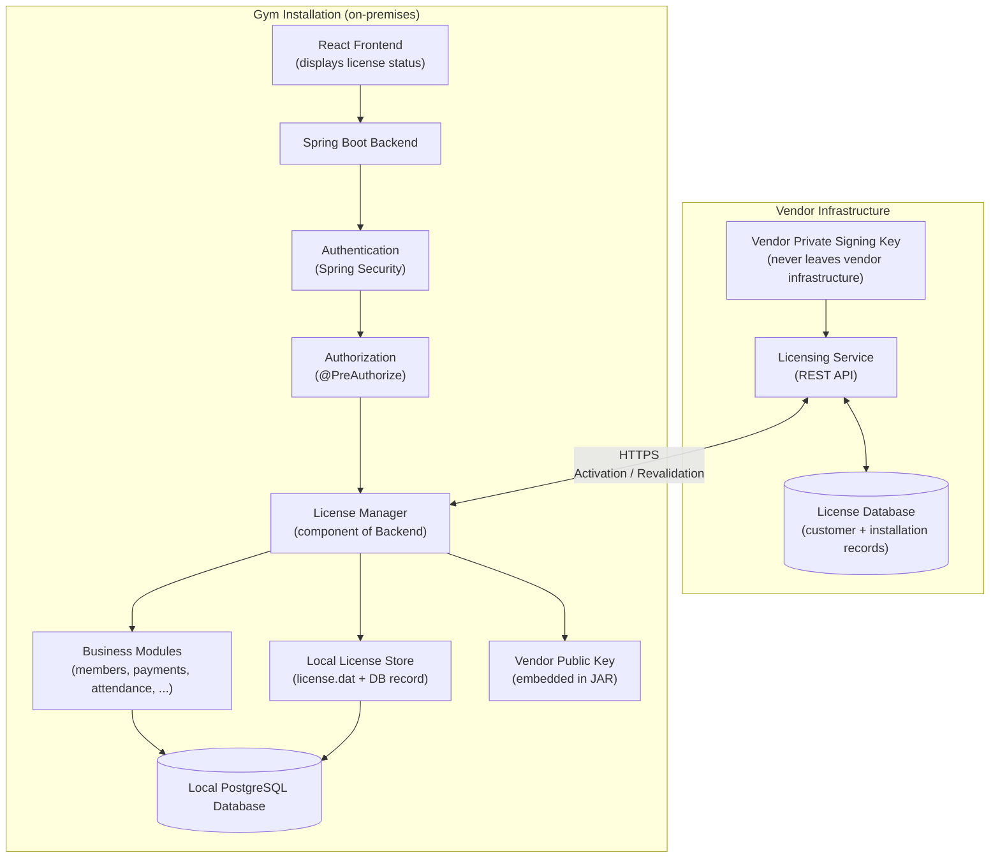
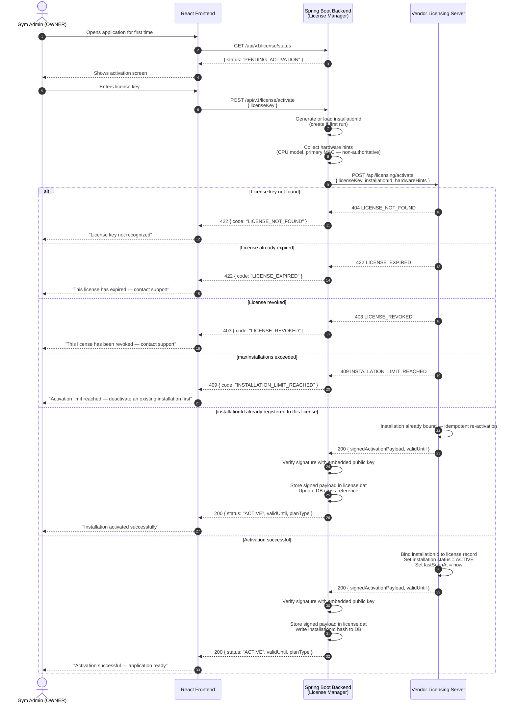
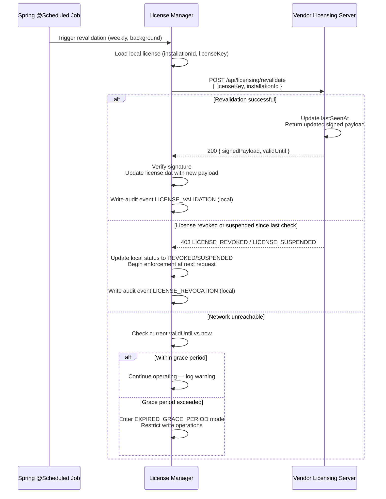
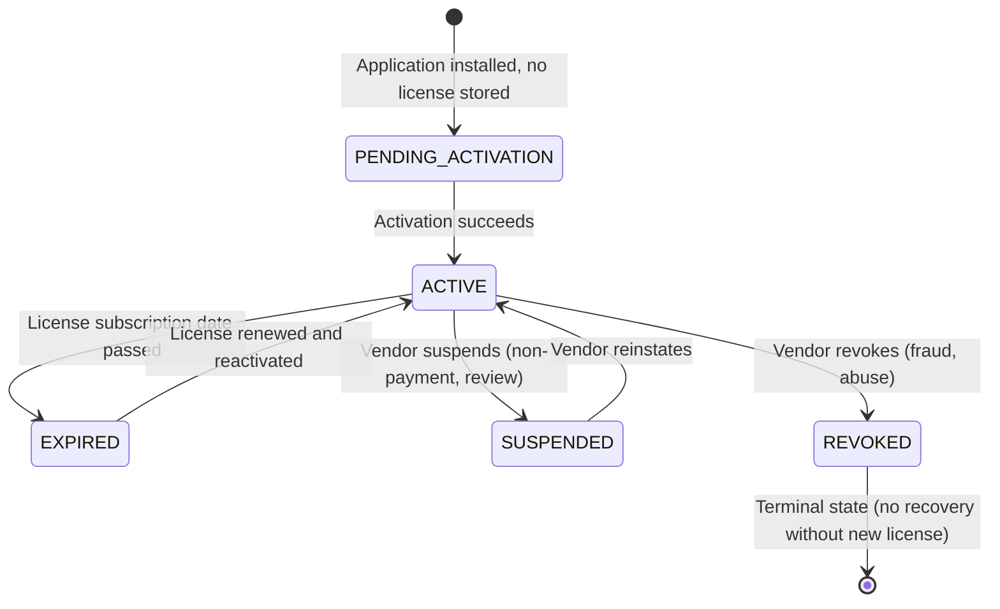
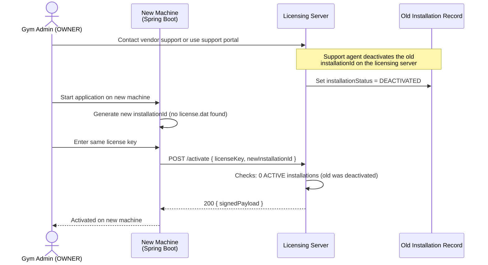
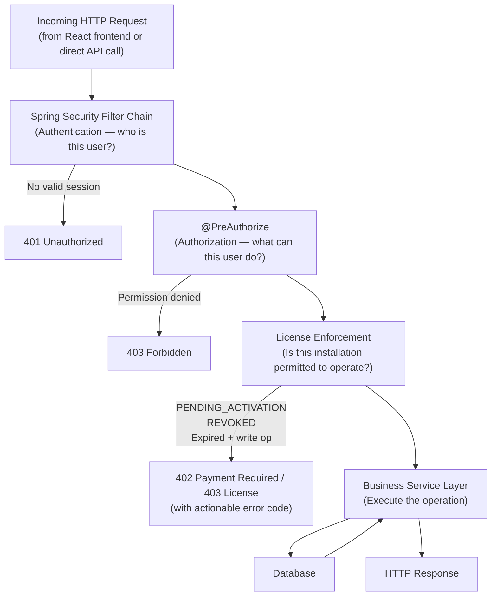

# 11 — Licensing & Anti-Piracy Architecture

> **Design Status:** Design documentation only. No licensing code, migrations, or implementation exists yet. See [§ Implementation Boundary](#implementation-boundary) at the end of this document.

---

## Table of Contents

1. [Product Context](#1-product-context)
2. [Security Reality & Design Philosophy](#2-security-reality--design-philosophy)
3. [Architecture Overview](#3-architecture-overview)
4. [License Server — Vendor Infrastructure](#4-license-server--vendor-infrastructure)
5. [License Model](#5-license-model)
6. [Installation Identity](#6-installation-identity)
7. [Signed License Design](#7-signed-license-design)
8. [Activation Flow](#8-activation-flow)
9. [Periodic Revalidation](#9-periodic-revalidation)
10. [Offline Operation](#10-offline-operation)
11. [License States](#11-license-states)
12. [License Expiration & Restricted Mode](#12-license-expiration--restricted-mode)
13. [License Revocation](#13-license-revocation)
14. [Installation Limits & Replacement](#14-installation-limits--replacement)
15. [Copying the Installation](#15-copying-the-installation)
16. [Backup & Restore Interaction](#16-backup--restore-interaction)
17. [License Enforcement in the Request Pipeline](#17-license-enforcement-in-the-request-pipeline)
18. [Authentication, Authorization, and Licensing — Distinctions](#18-authentication-authorization-and-licensing--distinctions)
19. [Roles, Permissions, and Licensing — Distinctions](#19-roles-permissions-and-licensing--distinctions)
20. [Local License Storage](#20-local-license-storage)
21. [Audit Integration](#21-audit-integration)
22. [Threat Model](#22-threat-model)
23. [Security Principles](#23-security-principles)
24. [Commercial Licensing Model — Future Extensions](#24-commercial-licensing-model--future-extensions)
25. [Open Decisions](#25-open-decisions)
26. [Implementation Boundary](#26-implementation-boundary)

---

## 1. Product Context

### Deployment Model

The Gym Management System is a **commercial, locally-installed application**. Each licensed gym runs its own independent installation on their local hardware:

```
Gym Desktop / Local Server
        │
        ├── React Frontend (static files served by Spring Boot)
        │
        └── Spring Boot Backend (single JAR)
                │
                └── Local PostgreSQL Database
```

This is distinct from a SaaS deployment where all customers share a single hosted instance. Because each gym runs software on hardware they physically control, licensing enforcement cannot rely solely on network-level controls.

### Licensing Goal

> A legitimate gym should be able to install and use the software reliably — including during temporary internet outages — while unauthorized copying of the software to another machine should not result in a usable, fully-functional licensed installation.

The licensing system must accomplish this without making reliable operation for legitimate customers unnecessarily fragile.

---

## 2. Security Reality & Design Philosophy

### The Fundamental Limit

> **Perfect piracy prevention is impossible for software that runs on hardware controlled by the customer.**

A user with complete administrator or root access to their own machine can potentially:

- Reverse engineer compiled JARs (Java bytecode is decompilable)
- Modify or patch application binaries
- Patch the JVM or class loading to bypass checks
- Modify local files including license files
- Manipulate the operating system clock or environment
- Inspect and modify the local database

No licensing system running entirely on customer hardware can prevent a sufficiently motivated and technically capable attacker from breaking it.

### The Correct Goal

The design goal is not:

> "Make piracy mathematically impossible."

The design goal is:

> "Make unauthorized redistribution **difficult, detectable, and commercially unattractive** while keeping legitimate customers' installations **reliable and undisrupted**."

### Design Priorities in Order

1. **Reliability for legitimate customers** — A hardware failure, internet outage, or OS reinstall must not destroy a legitimate customer's access to their own business data.
2. **Friction against casual copying** — Copying the installation directory to another machine must not produce a working licensed copy without intervention.
3. **Detectability** — The licensing server detects when a license is used from multiple locations or at unusual patterns.
4. **Resistance against technical attacks** — Signed licenses, code signing, and obfuscation raise the cost for technically motivated attackers.
5. **Revocability** — The vendor must be able to terminate a fraudulent license.

This document does not claim this design prevents all piracy. It claims this design makes piracy difficult enough that it is not commercially attractive for most actors.

---

## 3. Architecture Overview



### Component Responsibilities

| Component | Location | Responsibility |
|---|---|---|
| **Licensing Service** | Vendor infrastructure | Validates license keys, binds installations, issues signed activation payloads, tracks usage |
| **License Database** | Vendor infrastructure | Stores all customer, license, and installation records |
| **Vendor Private Key** | Vendor infrastructure only | Signs activation payloads — never distributed |
| **License Manager** | Gym (Spring Boot) | Verifies signed license locally, calls licensing service for activation/revalidation, enforces license state on every API request |
| **Local License Store** | Gym (filesystem + DB) | Stores signed activation payload and installation identity locally |
| **Vendor Public Key** | Gym (embedded in JAR) | Verifies signatures without requiring private key on-site |

---

## 4. License Server — Vendor Infrastructure

### Why It Exists

The licensing server is the authoritative record of:

- Which license keys exist and their terms
- How many installations each license has activated
- Whether a license is active, suspended, or revoked
- The binding between a license key and a specific installation

Without a server-side record, the vendor cannot enforce installation limits, cannot revoke licenses, and cannot detect when the same license is used from multiple locations. A pure offline license system is significantly weaker against sharing.

### What the Licensing Server Stores

```
License
  ├── licenseKey            (unique identifier given to the customer)
  ├── customerId            (links to customer/gym record)
  ├── planType              (e.g., STANDARD, PROFESSIONAL)
  ├── licenseStatus         (ACTIVE, EXPIRED, SUSPENDED, REVOKED)
  ├── issuedAt
  ├── expiresAt
  ├── maxInstallations      (typically 1 for a single-gym license)
  ├── enabledFeatures       (for future feature-based licensing)
  └── installations[]
        ├── installationId  (UUID bound at activation)
        ├── activatedAt
        ├── lastSeenAt
        ├── ipAddress        (last seen, informational only)
        ├── hardwareHints    (non-authoritative, for anomaly detection)
        └── installationStatus (ACTIVE, DEACTIVATED)
```

### What the Local Application Stores

The gym machine stores only what is needed to:
1. Operate without continuous internet connectivity
2. Verify its own activation offline

It does NOT store:
- Other customers' records
- Raw customer PII from the licensing server
- The vendor's private signing key
- The complete license history

The local store is described in detail in [§ 20 — Local License Storage](#20-local-license-storage).

---

## 5. License Model

### Distinction: Vendor-Side vs. Local

Two separate sets of license information exist. They serve different purposes and must not be conflated.

#### Vendor-Side License Information

Stored on the licensing server. Authoritative. The vendor controls this entirely.

```
vendorLicense {
  licenseKey        String  — unique, given to customer at purchase
  gymName           String  — customer name for support purposes
  contactEmail      String
  planType          Enum    — e.g., STANDARD
  licenseStatus     Enum    — ACTIVE | EXPIRED | SUSPENDED | REVOKED
  issuedAt          Instant
  expiresAt         Instant (null if perpetual — OPEN DECISION)
  maxInstallations  Int     — typically 1
  enabledFeatures   Set<String>   — for future use
  installations[]           — see § 6
}
```

#### Local Installation License Information

Stored on the gym machine. Used for offline verification. Derived from the vendor's signed activation payload.

```
localLicense {
  licenseKey          String  — echoed from vendor record
  installationId      UUID    — this installation's unique identity
  planType            String  — cached from vendor record
  enabledFeatures     Set<String>
  activatedAt         Instant
  validUntil          Instant — renewed by revalidation
  signaturePayload    Bytes   — the full signed blob from the vendor
  signature           Bytes   — cryptographic signature over payload
}
```

The `validUntil` field is set by the licensing server and signed. The local application verifies the signature using the embedded public key and checks `validUntil` against the current time. The `validUntil` date is always set to a future date by the server to allow offline operation — see [§ 10 — Offline Operation](#10-offline-operation).

---

## 6. Installation Identity

### How an Installation ID Is Generated

When the Spring Boot application starts for the first time and no installation identity exists:

1. Generate a **cryptographically random UUID v4** — this is the `installationId`.
2. Store this UUID in the local license file (outside the database — see [§ 20](#20-local-license-storage)).
3. Record a hash of it in the local database as a cross-reference.

This UUID is **not** derived from hardware. It is purely random. It identifies the installation, not the machine.

**Why not derive the ID from hardware serial numbers?**

Hardware-fingerprinted IDs are brittle. They break on:
- RAM replacement
- Disk replacement
- NIC change
- VM migration
- Cloud instance resize

A random Installation ID that can be reset through a managed support process is more reliable for legitimate customers and does not meaningfully reduce anti-piracy protection, because the Installation ID is verified by the licensing server at activation and during revalidation.

### Hardware Characteristics as Supporting Signal

While the Installation ID is random, the application may also collect non-authoritative **hardware hints** (e.g., CPU model string, primary MAC address, disk serial) and send them to the licensing server during activation and revalidation. These are:

- Stored on the vendor side as informational context
- Used for anomaly detection (e.g., sudden change in hardware profile without a declared replacement)
- Never used as the primary identity mechanism
- Never stored unencrypted in the local license file

Hardware hints help the support team investigate suspicious activation patterns but cannot replace the Installation ID as the binding mechanism.

### Storage Location

```
Primary:   <app-config-dir>/license.dat   — file on the filesystem
Secondary: installation_id column in      — local database, cross-check only
           local_license table
```

The file-based store is authoritative. The database record is a cross-check used to detect tampering (if the file and DB record disagree, flag for revalidation).

### Participation in Activation

During activation, the local application sends the `installationId` to the licensing server. The server:

1. Validates the license key
2. Checks if the license can accept another installation (`currentInstallations < maxInstallations`)
3. Binds the `installationId` to the license record on the server
4. Includes the `installationId` in the signed activation payload returned to the client

The signed payload now contains the `installationId`. On every startup, the local application verifies:
- The signature is valid
- The `installationId` in the payload matches the locally stored `installationId`
- The `validUntil` date has not passed (or the grace period has not elapsed)

### After OS Reinstall

After an OS reinstall, the license file is typically lost. The application generates a new `installationId` on next start and enters `PENDING_ACTIVATION` state. The customer must reactivate.

**Reactivation on the same machine** (same hardware, new OS): The licensing server will see a new `installationId` from the same license. The server can automatically permit reactivation if the old installation is automatically deactivated, or a support agent can deactivate the old installation to free the slot. The hardware hints help confirm it is the same physical machine.

### After Hardware Replacement

Same process as OS reinstall: new `installationId`, reactivation required. Support deactivates the old installation to free the slot. This is by design — hardware replacement is a supported event and should not be punishing for legitimate customers.

### Support Reset Process

The vendor support team can:

1. Deactivate the old installation ID on the licensing server (freeing the slot)
2. The customer activates fresh on the new machine

This is a deliberate and logged action. The licensing server records all installation changes with timestamps.

---

## 7. Signed License Design

### Concept

```
Vendor Private Key
       │
       │ signs
       ▼
License Payload {
  licenseKey
  installationId
  planType
  enabledFeatures
  activatedAt
  validUntil
  issuedBy: "vendor.fitzone.com"
  schemaVersion: 1
}
       │
       ▼
Signed Activation Blob
       │
       │ sent to gym over HTTPS
       ▼
Local License Store

       ┌───────────────────┐
       │  Vendor Public Key │  (embedded in Spring Boot JAR at build time)
       └────────┬──────────┘
                │
                │ verifies signature
                ▼
        Signature valid?
          ├── YES → extract payload, use values
          └── NO  → reject, require reactivation
```

### Why Signatures Instead of Encryption

**Encryption** hides the content of a message but does not prove who created it. If the license file were simply encrypted, anyone who reverse-engineered the decryption key from the JAR could forge arbitrary license files.

**Digital signatures** prove that the license payload was created by whoever holds the private key. Since the private key exists only on vendor infrastructure and is never distributed, no one else can forge a valid signature — even if they have the public key and can read the license payload in plaintext.

The guarantee is:

> "This license payload has not been modified since the vendor signed it, and only the vendor could have produced this signature."

Modifying any field in the payload (e.g., extending `validUntil`) invalidates the signature. The application detects this and rejects the modified license.

### Key Custody

| Key | Location | Who has access |
|---|---|---|
| Vendor Private Key | Vendor secure infrastructure | Vendor only — never on a gym machine |
| Vendor Public Key | Embedded in Spring Boot JAR | All gym installations — read-only, cannot forge signatures |

The private key must be stored in a hardware security module (HSM) or a secret management service (e.g., HashiCorp Vault, AWS KMS) on vendor infrastructure. It must never be committed to source control.

---

## 8. Activation Flow

### First Installation — Sequence Diagram



### Required Information for Activation

| Field | Direction | Notes |
|---|---|---|
| `licenseKey` | Gym → Server | Provided by admin; issued by vendor at purchase |
| `installationId` | Gym → Server | Random UUID generated locally on first run |
| `hardwareHints` | Gym → Server | Non-authoritative; CPU model, MAC address hash |
| `signedActivationPayload` | Server → Gym | Signed blob containing license terms and validity window |
| `validUntil` | Server → Gym | Date inside the signed payload — sets offline grace window |

### Activation Failure Handling

| Error | HTTP Status | Cause | Resolution |
|---|---|---|---|
| `LICENSE_NOT_FOUND` | 404 | Key does not exist | Check for typos; contact vendor |
| `LICENSE_EXPIRED` | 422 | License subscription has elapsed | Renew with vendor |
| `LICENSE_REVOKED` | 403 | Vendor revoked this license | Contact vendor; may indicate fraud |
| `LICENSE_SUSPENDED` | 403 | Temporarily suspended by vendor | Contact vendor |
| `INSTALLATION_LIMIT_REACHED` | 409 | All allowed installations are active | Deactivate an old installation via support |
| Network unreachable | — | Licensing server not reachable | Retry when internet is available; cannot activate offline |

**Note:** Activation requires internet connectivity. A fresh installation cannot be activated offline. This is by design — the first activation must be validated server-side to bind the Installation ID.

---

## 9. Periodic Revalidation

### Purpose

Activation binds the installation permanently to a license. Revalidation serves a different purpose:

- Refreshes the `validUntil` date in the signed payload to extend offline operation
- Allows the licensing server to propagate updates: expiry, suspension, revocation
- Detects suspicious usage patterns (same installation ID from different IP ranges)

### Revalidation Flow



### Revalidation Schedule

**OPEN DECISION:** Exact revalidation frequency. Recommended baseline:

| Event | Timing |
|---|---|
| Revalidation attempt | Weekly (every 7 days), background `@Scheduled` job |
| `validUntil` set by server | 35 days from revalidation (provides 28-day buffer beyond weekly cadence) |
| Grace period after `validUntil` | **OPEN DECISION** — see [§ 10](#10-offline-operation) |

The revalidation job runs silently in the background. Gym staff do not need to interact with it. Failure is logged internally and triggers restricted mode only after the grace period.

---

## 10. Offline Operation

### Model

```
Internet available  →  Revalidation succeeds  →  validUntil extended
Internet unavailable →  Local license check    →  validUntil from last revalidation
                                               →  If within grace: operate normally
                                               →  If past grace:   enter restricted mode
```

### Grace Period Design

The grace period is the duration after `validUntil` before the application enters restricted mode. Choosing this value requires balancing three competing concerns:

| Concern | Shorter grace period | Longer grace period |
|---|---|---|
| **Piracy resistance** | Better — revocation takes effect sooner | Worse — a blocked license operates longer offline |
| **Customer usability** | Worse — any internet outage causes disruption | Better — short-term outages are invisible to users |
| **Offline reliability** | Worse — rural or unstable internet causes disruption | Better — system tolerates poor connectivity |

**OPEN DECISION:** Grace period duration. Recommended: **30 days**.

**Justification for 30 days:**
- Most gyms have internet access for at least one day per month (enough to trigger a revalidation).
- A 30-day grace period tolerates extended outages, holidays, and temporary ISP failures without impacting the business.
- 30 days is long enough that legitimate customers are not disrupted, but short enough that a revoked license does not operate indefinitely.
- The licensing server sets `validUntil` = 35 days from the revalidation date, so a successfully revalidating installation has a 35 + 30 = 65-day maximum offline window before the first restriction appears.

**What `validUntil` is NOT:** It is not the license expiration date. `validUntil` is the freshness window for offline operation. The license expiration date is a separate field in the signed payload.

### What Happens When Internet Is Unavailable

1. The background revalidation job attempts to contact the licensing server.
2. The attempt fails (timeout or DNS failure).
3. The License Manager checks the current `validUntil` from the local signed license.
4. If `now < validUntil`: the application continues operating normally. A warning is logged internally.
5. If `now >= validUntil` but within the grace period: the application continues operating normally. A warning is shown to the OWNER user in the UI.
6. If the grace period has elapsed: the application enters restricted mode (see [§ 12](#12-license-expiration--restricted-mode)).

---

## 11. License States

### Selected States

Five license states are used. States that are redundant or not operationally necessary are excluded.



### State Reference

| State | Meaning | Caused by | Application behavior | Online verification required |
|---|---|---|---|---|
| `PENDING_ACTIVATION` | Installed but no valid activation exists | Fresh install, OS reinstall, corrupted license file | Only activation endpoint accessible; all business endpoints blocked | Yes — activation requires internet |
| `ACTIVE` | License is valid and verified | Successful activation or revalidation | Full functionality based on plan | No — offline operation within validity window |
| `EXPIRED` | License subscription date has passed | Subscription end date reached | Restricted mode — read-only (see § 12) | On next revalidation attempt |
| `SUSPENDED` | Temporarily suspended by vendor | Non-payment, dispute, pending review | Restricted mode — same as EXPIRED | Lifted when vendor reinstates and next revalidation occurs |
| `REVOKED` | Permanently revoked by vendor | Fraud, chargebacks, abuse, legal | Access blocked after grace period; data preserved | Detected at next revalidation |

### State Transitions During Offline Operation

When offline:
- `ACTIVE` remains `ACTIVE` as long as the locally stored `validUntil` has not elapsed (or within the grace period).
- `REVOKED` and `SUSPENDED` states set by the licensing server are only propagated to the local installation during a successful revalidation attempt. A revoked installation that is offline continues operating until its grace period ends.

This is a **known and accepted residual risk**. The alternative — instant revocation — would require constant internet connectivity and is unacceptable for an on-premises system.

---

## 12. License Expiration & Restricted Mode

### Design Principle

> License expiration must never destroy or block access to business data. A gym with an expired license is a business with a software payment problem — their member records, payments, and history must remain intact.

### Restricted Mode Behavior

When a license enters `EXPIRED` or `SUSPENDED` state, the application enters **restricted mode**:

| Operation | Restricted Mode | Rationale |
|---|---|---|
| View existing members | **Allowed** | Read-only access to business data must be preserved |
| View memberships, payments, attendance | **Allowed** | Historical data access is always permitted |
| View reports | **Allowed** | Read-only reporting is permitted |
| Export data | **Allowed** | Customers must be able to export their data |
| Backup | **Allowed** | Backup must work even when expired to protect business data |
| Create new members | **Blocked** | Write operations suspended |
| Record payments | **Blocked** | Financial write operations suspended |
| Mark attendance | **Blocked** | Operational write operations suspended |
| Modify settings | **Blocked** | Configuration changes suspended |
| User management | **Blocked** | Administrative write operations suspended |
| Activate/renew license | **Allowed** | Recovery path must always be available |

**OPEN DECISION:** Exact set of operations permitted in restricted mode. The table above is a recommended baseline. Product management must confirm before implementation.

### Recovery Path

When a license is renewed with the vendor and revalidation succeeds, the application transitions directly from `EXPIRED`/`SUSPENDED` back to `ACTIVE`. All previously blocked operations are restored. No data is lost during restricted mode.

### What `REVOKED` is Different

A `REVOKED` license is a terminal state. The application eventually enters a harder restriction — all operations blocked — after detecting revocation from the licensing server. Business data remains accessible for export only, but the application is no longer operational.

**OPEN DECISION:** Whether `REVOKED` allows a data export grace window (recommended: yes, for a limited time).

---

## 13. License Revocation

### Revocation Reasons

The vendor may revoke a license for:

- Fraudulent activation (using a shared or stolen license key)
- Chargebacks or payment fraud
- Contractual termination
- Deliberate violation of license terms (e.g., reselling the software)

### Online Detection

When the gym machine calls the licensing server (activation or revalidation) and the license has been revoked:

```
Revalidation attempt
      ↓
Licensing Server returns 403 LICENSE_REVOKED
      ↓
License Manager updates local state to REVOKED
      ↓
Blocked operations enforced at next request
      ↓
OWNER user sees revocation notice in UI
```

### Offline Machine at Time of Revocation

If the gym machine is offline when the vendor revokes the license, the revocation cannot be propagated immediately. The machine continues to operate under its locally stored `validUntil` date. Only when the machine reconnects and attempts revalidation does it receive the revocation.

This is an accepted trade-off. The grace period design (30 days recommended) means that for most practical scenarios, revocation takes effect within 30 days at most.

**Residual risk:** A gym with a revoked license could block internet access permanently and operate for the full grace period before entering restricted mode. This is documented in [§ 22 — Threat Model](#22-threat-model).

---

## 14. Installation Limits & Replacement

### Enforcement

The licensing server enforces `maxInstallations`. For a standard single-gym license, `maxInstallations = 1`.

```
Activation request: licenseKey + installationId
        ↓
Licensing Server checks: count(ACTIVE installations for this license)
        ├── < maxInstallations → bind and activate
        └── >= maxInstallations → reject 409 INSTALLATION_LIMIT_REACHED
```

### Replacement Workflow (Hardware Replacement)

When a gym replaces their server machine:



**Design principle:** Hardware replacement must not require purchasing a new license. The vendor support process for installation slot reset must be clearly documented and low-friction.

**OPEN DECISION:** Whether to provide a self-service installation deactivation portal, or require contacting vendor support. Self-service is recommended for customer experience but requires the portal's own authentication.

### Multi-Installation Plans

Future plans may permit `maxInstallations > 1` (e.g., a franchise with multiple locations). The architecture supports this — the licensing server simply allows more active installations for those license keys. The local application behavior is identical regardless of the limit.

---

## 15. Copying the Installation

### Scenario A: Copy Application Directory Only

```
Original machine has: JAR + license.dat + config files
        ↓
Admin copies these files to a second machine
        ↓
Second machine starts the application
```

**What happens:**

The `license.dat` file contains a signed payload where `installationId = "abc-123"`. The second machine has no prior installation identity (the file was copied, not generated). On startup, the License Manager reads `license.dat` and finds `installationId = "abc-123"`.

However, the local database has no corresponding installation record (fresh database). The License Manager detects the mismatch (license file exists but database cross-reference does not), flags the inconsistency, and requires revalidation with the licensing server.

At revalidation, the server sees `installationId = "abc-123"` from a new IP address. This may be flagged as suspicious. The server can either: (a) permit revalidation (same ID, possibly same machine moved), or (b) require human review.

**Outcome:** The copied installation cannot silently pass as a fresh valid installation on a different machine. It either requires revalidation or is blocked.

### Scenario B: Copy Application + Database

```
Original machine has: JAR + license.dat + PostgreSQL database
        ↓
Admin copies everything to a second machine
        ↓
Both machines now have identical data
```

**What happens:**

Both machines now have the same `installationId = "abc-123"` and the same signed license payload. If both machines run simultaneously, both will attempt revalidation with the same Installation ID.

The licensing server detects that two different IP addresses are sending revalidation requests for the same `installationId`. This triggers a suspicious-usage alert. The server's response can be:
- Log the anomaly for manual review
- Require one or both to go through a full reactivation process

**Residual risk:** If only one machine operates at a time (they run on different schedules) and revalidation intervals don't overlap, the licensing server may not detect the duplication. This is a known residual risk.

**Mitigation:** The signed payload includes the `installationId`. A new, independently operated machine with its own fresh database will not have this `installationId` in the cross-reference DB record, causing inconsistency detection on startup.

### Scenario C: Copy License File Only

```
license.dat copied to a new machine
New machine has a different installationId in its own database
        ↓
License Manager loads license.dat: installationId = "abc-123"
License Manager checks DB: installationId stored = "xyz-789"
        ↓
MISMATCH detected
        ↓
Require full reactivation
```

This is the standard copy-protection mechanism: the signed license file is bound to a specific Installation ID. Moving the file to a machine with a different ID fails verification.

### Claim Boundaries

This design does not claim to prevent:
- A determined attacker who copies both the license file and the database
- A determined attacker who patches the JAR to skip the cross-reference check
- An attacker who has root access to the original machine and can manipulate all files

These scenarios represent technically sophisticated attacks documented in the threat model.

---

## 16. Backup & Restore Interaction

### The Risk

The application already includes backup and restore functionality (`POST /api/v1/backup/create`, `POST /api/v1/backup/restore`). A database backup contains all business data: members, memberships, payments, attendance, settings, and audit logs.

**The risk:** If a restore operation also restores license-related installation data, it could theoretically clone a valid installation onto any machine that has a database backup.

### Design Decision: License Identity Is Not Business Data

The Installation ID and signed license payload are **not business data**. They must be treated as separate from the data that backs up and restores:

```
Business data (backed up and restored normally):
  ├── members
  ├── memberships
  ├── payments
  ├── attendance
  ├── trainers
  ├── leads
  ├── expenses
  ├── inventory
  ├── equipment
  ├── notifications
  ├── audit_logs
  └── gym_settings

License identity (NOT backed up / restored with business data):
  ├── installation_id (stored in license.dat, not in DB backup)
  └── local_license (DB table excluded from pg_dump scope, or restored as PENDING)
```

### Restore Behavior

When a backup is restored:

1. **Business data** is restored as normal — all member records, payments, history are intact.
2. **License table** (`local_license` if present in DB): the restore **resets this table** to `PENDING_ACTIVATION` state, rather than restoring the old activation record.
3. **`license.dat` file**: is **not included** in the database backup. It is a filesystem file. A database restore does not affect it.

**On the same machine (disaster recovery):**
The `license.dat` file still exists on the filesystem (backup is DB-only). License state is preserved. Application continues operating after restore without reactivation.

**On a different machine (attempted clone):**
The `license.dat` file is not present (different filesystem). The database `local_license` table was reset to `PENDING_ACTIVATION` during restore. The application requires reactivation with the licensing server, which will check installation limits.

### Recommendation

The restore endpoint (`POST /api/v1/backup/restore`) must explicitly:
1. Exclude or reset the `local_license` table after restore
2. Not copy or restore `license.dat`
3. Present a clear warning to the OWNER: "After restoring, if this is a new machine, the license will require reactivation."

---

## 17. License Enforcement in the Request Pipeline

### Enforcement Is in the Spring Boot Backend

The React frontend may display license status information (e.g., an "expired" banner), but **frontend-only license checks are not a security boundary**:

- The React frontend runs in the browser and can be manipulated by the user
- JavaScript can be modified in developer tools
- API calls can be made directly with tools like curl or Postman, bypassing the frontend entirely
- An attacker can call any backend endpoint without using the frontend

The backend must be the authoritative enforcement point.

### Conceptual Request Pipeline



### What License Enforcement Checks

The license enforcement layer (conceptually a Spring `HandlerInterceptor` or a Security filter) evaluates:

1. Is a valid, signed local license present?
2. Does the `installationId` in the license match the locally stored `installationId`?
3. Is the license status `ACTIVE` (or within grace period)?
4. If the license is in restricted mode, is this request for a read-only or a write operation?
5. Is the requested operation permitted by the current plan's `enabledFeatures`?

The check is fast — it reads from an in-memory cached license state, not from the database or the licensing server on every request. The cache is refreshed on startup and after each revalidation.

### License Endpoints Always Permitted

The following endpoints bypass license enforcement to allow recovery:

- `POST /api/v1/license/activate` — must always be accessible to recover from `PENDING_ACTIVATION`
- `GET /api/v1/license/status` — must always be accessible for the UI to display status
- `POST /api/v1/backup/create` — must always be accessible to preserve business data
- `GET /actuator/health` — always accessible (used by infrastructure monitoring)

---

## 18. Authentication, Authorization, and Licensing — Distinctions

These three mechanisms are related but address different questions. They must not be merged.

### Authentication

**Question:** "Who is this user?"

**Mechanism:** Spring Security processes the session cookie or JWT. `UserDetailsService` loads the user record from the database by email. A valid session means the user is authenticated.

**Scope:** Per-request, per-user.

**Failure:** `401 Unauthorized` — session expired or invalid credentials.

---

### Authorization

**Question:** "What is this user allowed to do?"

**Mechanism:** `@PreAuthorize("hasAuthority('members:create')")` on controller or service methods. The user's role maps to a set of permissions. The permission check runs after authentication.

**Scope:** Per-request, per-user, per-operation.

**Failure:** `403 Forbidden` — authenticated but lacking the required permission.

---

### Licensing

**Question:** "Is this installation (the gym's software copy) authorized to operate?"

**Mechanism:** The License Manager verifies the local signed license against the embedded public key. It checks `installationId` binding and `validUntil` date. It enforces restricted mode when the license is expired or suspended.

**Scope:** Per-request, per-installation, per-operation-type (read vs. write in restricted mode).

**Failure:** `402 Payment Required` or `403 LICENSE_EXPIRED` — installation is not in a valid license state.

---

### Combined Request Evaluation

```
User A makes a request
       ↓
1. Authentication:  Is this user's session valid?           → if NO: 401
       ↓
2. Authorization:   Does RECEPTIONIST have payments:record?  → if NO: 403
       ↓
3. Licensing:       Is this installation ACTIVE?             → if NO: appropriate license error
                    Is this operation permitted in plan?     → if NO: 402
       ↓
4. Business logic executes
```

A user with the correct role and permission is still blocked from performing write operations if the installation's license is in restricted mode. Licensing is evaluated independently of who the user is.

---

## 19. Roles, Permissions, and Licensing — Distinctions

### The Existing Permission System Is Not Replaced

The application already has a four-role permission system:

```
OWNER
ADMIN
RECEPTIONIST
TRAINER
```

With 40+ granular permissions (e.g., `members:create`, `payments:record`, `settings:edit`).

Licensing **does not replace this system**. Licensing operates at the installation level; permissions operate at the user level. The two systems are layered, not merged.

### How They Interact

Example: a license with the `payments` feature enabled, and a RECEPTIONIST user:

```
License allows "payments" feature
        ↓
RECEPTIONIST has permission "payments:record"
        ↓
User can record a payment

vs.

License allows "payments" feature
        ↓
TRAINER does NOT have permission "payments:record"
        ↓
User CANNOT record a payment (authorization failure, not a license failure)
```

And the inverse:

```
License does NOT allow "advanced_reports" feature (hypothetical future feature)
        ↓
OWNER has permission "reports:view"
        ↓
User CANNOT access advanced reports (license failure, not an authorization failure)
```

### Feature-Based Licensing Is a Future Extension

For v1, the recommended approach is: **one license grants full feature access**. All features are unlocked by an ACTIVE license. The `enabledFeatures` field exists in the license model but is not evaluated in v1.

Feature-based licensing (e.g., a "Basic" plan without the reports or inventory modules) is documented as a future extension in [§ 24](#24-commercial-licensing-model--future-extensions).

---

## 20. Local License Storage

### Storage Location

Licensing data is stored in two places, serving different purposes:

| Location | Content | Purpose |
|---|---|---|
| `<app-config-dir>/license.dat` | Signed activation payload (binary or base64) | Authoritative local store; survives DB restore |
| `local_license` table in DB | `installationId` hash, `licenseStatus`, `validUntil`, `activatedAt` | Cross-reference and auditing; detects tampering if it diverges from `license.dat` |

`<app-config-dir>` is the application's configuration directory, outside the database dump scope. On Linux this is typically `/opt/gym-app/` or `/etc/gym-app/`. It must not be included in `pg_dump`-based backups.

### Why Both?

**File only:** A database restore could not reset the license (license.dat is unaffected). Good. But querying license state in JPA requires reading a file — less natural.

**Database only:** The license record would be included in `pg_dump` and could be restored onto a different machine. Bad.

**Both:** The file is the authoritative store. The database record is a cached view for query convenience and a cross-reference check. If they disagree on startup, the application requires revalidation. This makes it harder to attack by modifying only one of the two.

### What Is NOT Stored Locally

| Data | Where it lives | Reason |
|---|---|---|
| Vendor private signing key | Vendor infrastructure only | Never on any gym machine |
| Other customers' license data | Licensing server only | No reason for a gym to hold this |
| Raw payment/billing information | Vendor infrastructure only | PCI concerns |
| Activation credentials (admin token) | Not persisted | Used only during the activation API call |

### Sensitivity of Local License Data

The `license.dat` file contains:
- The license key (already known to the customer)
- The installation ID (not a secret — it's only useful with the private key)
- The signed payload (can be read by anyone; security comes from the signature, not secrecy)

The `license.dat` file does not need to be encrypted at rest for security purposes (the signature provides tamper-evidence, not confidentiality). However, file permissions should restrict it to the application user (`gymapp:gymapp`, mode `600`).

---

## 21. Audit Integration

### Local Audit Log

The existing `audit_logs` table records business operations. Licensing events should be integrated into this log for OWNER visibility. Licensing events use a new `entityType` value: `LICENSE`.

### Events for the Local Audit Log

These events are visible to OWNER and ADMIN users in the audit log UI:

| Event | `action` | `entityType` | Triggered by |
|---|---|---|---|
| License activated | `CREATE` | `LICENSE` | Successful first activation |
| License revalidated | `UPDATE` | `LICENSE` | Successful revalidation (background job) |
| License expired | `UPDATE` | `LICENSE` | License Manager detects `expiresAt` passed |
| License revocation detected | `UPDATE` | `LICENSE` | Server returns REVOKED during revalidation |
| License suspended | `UPDATE` | `LICENSE` | Server returns SUSPENDED |
| License reinstated | `UPDATE` | `LICENSE` | Server returns ACTIVE after SUSPENDED |
| Installation deactivated | `DELETE` | `LICENSE` | Vendor support deactivates remotely |

**Note:** The `metadata` field of the audit log must **not** include the raw signed payload, license key, or installation ID hash. These are internal implementation details not suitable for display in an operational audit log. Store only: `licenseStatus`, `planType`, `validUntil` (as informational context).

### Events for the Vendor Licensing Server Only

These events are recorded on the vendor side and are not visible to gym staff:

- Raw activation request (IP address, timestamp, hardware hints)
- Revalidation frequency anomalies
- Duplicate Installation ID from different network origins
- Administrative actions (deactivation, revocation by vendor staff)

### Audit Log UI Impact

The existing audit log UI (`AuditEntityType`) will need a new `LICENSE` type added to `AuditEntityType`. This is a minor addition to the frontend audit types:

```ts
// Addition to frontend audit-log.types.ts (future integration)
export type AuditEntityType =
  | ... existing types ...
  | 'LICENSE'   // new
```

---

## 22. Threat Model

### Threat 1: Copy Application Directory to Another Machine

| | Detail |
|---|---|
| **Attack** | Admin copies the JAR, `license.dat`, and config files to a second machine |
| **Mitigation** | `license.dat` contains `installationId = "X"`. The second machine has no local DB cross-reference for "X". On startup, the License Manager detects the mismatch and requires revalidation. The licensing server sees a revalidation from a new IP — may flag for review. |
| **Residual risk** | If the second machine happens to be on the same LAN as the original, IP-based anomaly detection may not trigger. The cross-reference check is the primary defense. |

---

### Threat 2: Copy Application + Database

| | Detail |
|---|---|
| **Attack** | Admin copies everything: JAR, `license.dat`, and a full PostgreSQL dump to a new machine |
| **Mitigation** | Both machines now have identical `installationId`. If they revalidate simultaneously from different IPs, the licensing server detects the anomaly. Hardware hints differ between machines — another signal. |
| **Residual risk** | If only one machine operates at a time and IPs are not monitored, this could succeed for the grace period. This is a high-effort attack (requires full DB and file copy access, OS setup, etc.) — commercially unattractive in most scenarios. |

---

### Threat 3: Copy License File to Another Machine

| | Detail |
|---|---|
| **Attack** | Only `license.dat` is copied to a new machine |
| **Mitigation** | New machine has a different `installationId` in its own DB (or no DB yet). License Manager finds `installationId` in `license.dat` does not match local DB record. Requires reactivation. |
| **Residual risk** | Very low. The mismatch detection is reliable unless the attacker also manipulates the database. |

---

### Threat 4: Modify License Expiration Date in `license.dat`

| | Detail |
|---|---|
| **Attack** | Attacker opens `license.dat`, changes the `expiresAt` field to a future date |
| **Mitigation** | The signed payload is cryptographically signed by the vendor's private key. Any modification to any byte of the payload invalidates the signature. The License Manager verifies the signature on every startup using the embedded public key and rejects modified payloads. |
| **Residual risk** | Near zero for this specific attack. The only bypass is patching the JAR to skip signature verification (see Threat 6). |

---

### Threat 5: Modify the Installation ID

| | Detail |
|---|---|
| **Attack** | Attacker changes the locally stored `installationId` (in DB or config) to match a different valid signed license |
| **Mitigation** | To forge a match, the attacker would need a signed license payload that includes the new `installationId`. They cannot produce such a payload without the vendor's private key. Any `installationId` value that doesn't match the one in the signed payload will fail verification. |
| **Residual risk** | Very low. Requires possession of a validly signed license for the target installation ID. |

---

### Threat 6: Patch the Spring Boot JAR to Skip License Validation

| | Detail |
|---|---|
| **Attack** | Attacker decompiles the JAR (Java bytecode is decompilable), removes or comments out the License Manager check, repackages the JAR |
| **Mitigation** | 1. JAR signing (code signing) — the runtime can detect a modified JAR. 2. Code obfuscation (ProGuard) makes decompilation harder and slower. 3. This requires Java reverse engineering expertise and significant effort. |
| **Residual risk** | **High** for a technically competent attacker. This is the most capable attack vector against on-premises software and cannot be fully prevented. The goal is to make it expensive enough to not be commercially worthwhile. This is a documented limitation of all locally-installed software licensing systems. |

---

### Threat 7: Block Internet Access Permanently

| | Detail |
|---|---|
| **Attack** | Attacker configures firewall rules to permanently prevent the application from reaching the licensing server after activation |
| **Mitigation** | After the grace period (recommended: 30 days), the application enters restricted mode. Write operations are blocked. The attacker gets a read-only system, not a fully functional one. |
| **Residual risk** | During the grace period, full operation continues. A 30-day grace period means the attacker gets at most 65 days of full operation (35-day validity + 30-day grace) before restriction. After that, restricted mode applies indefinitely. |

---

### Threat 8: Replay an Activation Response

| | Detail |
|---|---|
| **Attack** | Attacker intercepts the activation response from the licensing server and stores it. Later (after the license expires or is revoked), they replay the old activation response to the local License Manager |
| **Mitigation** | The signed payload includes `validUntil` and `issuedAt` timestamps. An expired `validUntil` causes the grace period check to fail. The installation's local signature verification reads `validUntil` from the payload — it cannot be extended without forging the signature. |
| **Residual risk** | Low. The replay succeeds only during the validity window of the replayed token — which is the same window the attacker would have anyway. |

---

### Threat 9: Use the Same License Key on Multiple Machines

| | Detail |
|---|---|
| **Attack** | Attacker (or legitimate customer) shares their license key with a second gym |
| **Mitigation** | The licensing server enforces `maxInstallations`. When the second machine attempts activation with the same key, the server rejects it (`409 INSTALLATION_LIMIT_REACHED`) if the limit has been reached. |
| **Residual risk** | If the customer deactivates the first installation and activates the second, then repeatedly alternates, they can share one license serially. This is detectable via rapid installation cycling alerts on the server side but is difficult to prevent technically without making hardware replacement painful for legitimate users. |

---

### Threat 10: Restore an Old Backup to Another Machine

| | Detail |
|---|---|
| **Attack** | Attacker obtains a database backup (e.g., a backup `.sql` file) and restores it to a new machine, attempting to clone a valid licensed installation |
| **Mitigation** | The restore process resets the `local_license` DB table to `PENDING_ACTIVATION`. `license.dat` is not included in the backup. The new machine requires fresh activation, which the licensing server will validate against installation limits. |
| **Residual risk** | Low if the restore process is correctly implemented. If the restore process is NOT carefully designed to exclude license state (see [§ 16](#16-backup--restore-interaction)), this attack succeeds. The implementation of backup/restore must be audited against this threat. |

---

### Threat Summary

| Threat | Difficulty | Mitigation Strength | Residual Risk |
|---|---|---|---|
| Copy app directory | Low | Strong | Low — cross-reference check catches it |
| Copy app + database | High (effort) | Medium | Medium — IP anomaly detection helps |
| Copy license file | Low | Strong | Very low — ID mismatch |
| Modify expiry date | Low | Very strong | Very low — signature invalidation |
| Modify installation ID | Medium | Strong | Low |
| Patch JAR | High (skill) | Medium | **High** — unavoidable for skilled attacker |
| Block internet | Low | Medium | Medium — grace period limits |
| Replay activation | Medium | Strong | Low |
| License key sharing | Low | Medium | Medium — detected via cycling |
| Restore backup to new machine | Medium | Strong | Low (if restore correctly implemented) |

---

## 23. Security Principles

The following principles govern the licensing implementation. These are non-negotiable requirements that must be verified during implementation review.

1. **Private signing key exists only on trusted vendor infrastructure.** It must never be stored on a gym machine, in source code, or in any publicly accessible location.

2. **The public verification key may be embedded in the application.** Possessing the public key provides no ability to forge signatures — only to verify them.

3. **License payloads must be tamper-evident.** Any modification to the signed payload must cause signature verification to fail.

4. **Activation and revalidation communication must use HTTPS.** Plain HTTP is never acceptable for license-related API calls.

5. **Server-side installation limits must be enforced by the licensing server.** The local application cannot be trusted to self-report its activation count.

6. **Frontend checks are not a security boundary.** The React UI may display license status and disable UI elements, but all license enforcement must be in the Spring Boot backend.

7. **Backend license checks are required on every business operation.** Not just on startup.

8. **Licensing must not rely solely on easily changeable local timestamps.** A user setting the system clock forward or backward must not defeat license expiration. `validUntil` is read from the signed payload, which cannot be modified without the private key.

9. **Legitimate offline operation must remain possible.** Temporary internet unavailability must not disrupt a validly licensed installation within the grace period.

10. **Business data must not be destroyed because of a license failure.** Restricted mode must preserve all existing data. Data deletion due to license expiration is never acceptable.

11. **The license recovery path must always be accessible.** Even in `PENDING_ACTIVATION` state, the activation endpoint and data backup endpoints must respond.

---

## 24. Commercial Licensing Model — Future Extensions

### Current Scope: Single Plan

For v1, the licensing model is simple: one plan, all features. An ACTIVE license grants access to the complete feature set. No feature gating occurs in v1.

The `enabledFeatures` field in the license model is present but not evaluated in v1.

### Future: Plan-Based Feature Licensing

Future licensing plans may gate specific feature modules:

```
Plans (conceptual, not finalized):
  ├── Basic
  │     └── Features: members, memberships, payments, attendance
  │
  ├── Professional
  │     └── Adds: reports, inventory, equipment, leads
  │
  └── Enterprise
        └── Adds: multi-location, advanced analytics, API access
```

**OPEN DECISION:** Whether to implement feature-based licensing at all, and which features to gate.

### How Feature Licensing Would Work

If implemented, the signed license payload would include:

```json
{
  "enabledFeatures": ["members", "memberships", "payments", "attendance", "inventory"]
}
```

The License Manager would check whether the requested operation's feature is in `enabledFeatures` before allowing it. This check would be part of the license enforcement layer described in [§ 17](#17-license-enforcement-in-the-request-pipeline).

Feature licensing does not interact with user permissions: a feature that is disabled by the license is unavailable to all users regardless of their role. A feature that is enabled by the license is still subject to role-based permission checks.

### Implementation Note

Do not build feature-based licensing infrastructure into v1 beyond defining the `enabledFeatures` field. Building enforcement before the feature set is decided creates premature architecture. The field should exist but be ignored until a feature-gating decision is made.

---

## 25. Open Decisions

The following decisions require product, commercial, or architecture approval before implementation begins. No default should be assumed silently.

| # | Decision | Options | Recommendation |
|---|---|---|---|
| OD-L1 | **License duration model** | Annual subscription vs. perpetual + maintenance | Subscription — aligns with recurring revenue and allows revalidation-based enforcement |
| OD-L2 | **Offline grace period** | 7 / 14 / 30 / 60 / 90 days | **30 days** — balances offline reliability with piracy resistance |
| OD-L3 | **Maximum installations per license** | 1 / 2 / 3 / configurable | 1 for standard plan |
| OD-L4 | **Restricted mode write operations** | Exact list of blocked/allowed operations | See § 12 for recommended baseline; requires product confirmation |
| OD-L5 | **Expired license behavior** | Read-only mode vs. full block vs. time-limited grace | Read-only mode — business data must remain accessible |
| OD-L6 | **Revocation behavior** | Immediate block vs. grace period vs. data export window | Grace period for export (recommended: 30 days from revocation) |
| OD-L7 | **Installation slot reset process** | Self-service portal vs. contacting vendor support | Self-service preferred for customer experience |
| OD-L8 | **Feature-based licensing** | Not in v1 / in v1 / future | Not in v1 — implement as future extension |
| OD-L9 | **Licensing server hosting** | Own server / AWS / Azure / third-party SaaS licensing platform | OPEN — depends on vendor infrastructure preferences |
| OD-L10 | **Hardware binding strictness** | Random ID only vs. ID + hardware hints required to match | Random ID only is recommended; hardware hints are advisory |
| OD-L11 | **Revalidation frequency** | Daily / weekly / monthly | Weekly — good balance of freshness vs. noise |
| OD-L12 | **Clock manipulation defense** | Rely on `validUntil` in signed payload vs. server-issued nonces | `validUntil` in signed payload is the primary defense; sufficient for this threat level |
| OD-L13 | **Offline activation** | Not supported / QR-code based / manual key exchange | Not supported in v1; all activation requires internet |
| OD-L14 | **License renewal UX** | In-app renewal portal / redirect to vendor website / email-based | OPEN — depends on vendor payment infrastructure |
| OD-L15 | **HTTPS for licensing server** | Always required | Required — not negotiable |

---

## 26. Implementation Boundary

> **Licensing is currently a design concern only. No license-related Spring Boot implementation should be created until this document has been reviewed and the Open Decisions in § 25 have been resolved.**

When implementation eventually begins, the following conceptual components will need to be built:

```
Conceptual future components (design only — no classes exist yet):

  License              — the license entity/value object for local storage
  Installation         — the installation identity model
  Activation           — the activation request/response flow
  LicenseValidation    — the local signature verification logic
  LicenseManager       — the central service coordinating validation, caching, revalidation
  LicenseEnforcement   — the Spring interceptor/filter that gates API requests
  RevalidationJob      — the @Scheduled background revalidation task
```

These are **conceptual design elements only**. They are not instructions to create Java classes, Spring beans, or database tables at this time.

The licensing server (vendor infrastructure) is entirely outside the scope of the gym application repository and will be a separate project.

---

*End of `11-licensing.md`*
